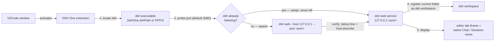

<p align="center">
  
</p>

<h1 align="center">DSH One</h1>

<p align="center">A VSCode extension that bridges <a href="https://www.npmjs.com/package/@deepseek-ai/dsh">DeepSeek Harness</a> (dsh) into your editor: it locates the dsh you installed yourself, starts or reuses its web service, embeds the UI inside VSCode, and sets your current folder as the dsh workspace. VSCode becomes dsh's launcher and display.</p>

<p align="center">
  <a href="https://github.com/imchangchang/dsh-one/actions/workflows/ci.yml"></a>
  <a href="LICENSE"></a>
  <a href="#compatibility"></a>
  <a href="#compatibility"></a>
</p>

<p align="center">
  <a href="#what-it-does">What it does</a> ·
  <a href="#quick-start">Quick start</a> ·
  <a href="#how-it-works">How it works</a> ·
  <a href="#security-and-permissions">Security</a> ·
  <a href="#compatibility">Compatibility</a> ·
  <a href="README.zh-CN.md">简体中文</a>
</p>

> Unofficial community project, not affiliated with DeepSeek. "dsh" belongs to its original project.

## What it does

- **dsh UI inside VSCode** — dsh web runs as a local service; DSH One shows it in an editor tab (iframe) and adds native sidebar views (Sessions tree + Chat panel).
- **Workspace sync** — your current folder is registered as the dsh workspace (idempotent), so dsh opens right where you are working.
- **Start or reuse** — the extension probes the configured port, adopts an already-running dsh instance (connects only, never kills it), or spawns its own `dsh web` otherwise.
- **Native sessions tree** — sessions grouped by workspace (current folder on top); create / rename / archive / fork sessions, open folders in other workspaces; auto-refreshes from the dsh host event stream.
- **Native chat panel** — markdown rendering, tool-call cards (with inline diffs), inline permission prompts and questions, one-click stop while running.
- **Send files into the conversation** — right-click any file in the editor or explorer → `DSH One: 发送到当前会话`; images show as thumbnails, other files as path chips.
- **Status bar** — shows `DSH: running :port / starting / stopped / error`; click to focus the panel.

## Quick start

Prerequisite: install dsh yourself (needs Node ≥ 22):

```bash
npm install -g @deepseek-ai/dsh@next
```

Then install the extension from the VS Code Marketplace and open the DSH One activity-bar icon. On first use the extension locates dsh and starts the service automatically (it prompts you to install dsh if it is missing). The extension never downloads or manages Node.js / dsh runtimes and does no update checks — upgrade dsh yourself with `npm update -g`.

Common commands (`Ctrl/Cmd+Shift+P`):

- `DSH One: 打开面板` — focus the sidebar Sessions view
- `DSH One: 打开 dsh 页面` — open dsh web in an editor tab
- `DSH One: 重启服务` / `DSH One: 停止服务` — manage the service
- `DSH One: 显示日志` — show the extension log

## How it works



1. **Locate dsh** — the `dshOne.dshPath` setting wins; otherwise `dsh` is looked up on PATH. If not found, the extension errors out and guides you to install it.
2. **Start the service** — the configured port (default 3080) is probed with `POST /api/host.describe` and the reply's `rpcId` is checked: if it is really dsh, the instance is adopted and reused (connect only, never kill); otherwise the extension spawns `dsh web --host 127.0.0.1 --port <port>`. Readiness needs double confirmation: the `dsh web: http://127.0.0.1:<port>` stdout line, then a `host.describe` identity check.
3. **Display** — an editor-tab WebviewPanel hosting an iframe pointing at `http://127.0.0.1:<port>/?dsh_embed=vscode`. Note: `dsh_embed=vscode` is a reserved embed parameter for the official UI; as of dsh 0.1.1-rc.2 the official UI does not consume it (the hidden-sidebar effect does not exist yet).
4. **Workspace preset** — once ready, the current VSCode folder is registered as a dsh workspace (`workspace.create`, idempotent) with a session underneath, so the dsh UI lands on your current folder via the "most recently active workspace" policy.
5. **Sidebar views** — a native sessions tree (grouped by workspace, live-updated from the host event stream) and a native chat panel (markdown, tool cards, inline permission prompts, stop button).

## Screenshots

<!-- TODO: 截图占位 — 请在真实 VSCode 中打开 DSH One 面板，截图后放到 assets/screenshots/（如 chat-panel.png、sessions-sidebar.png），并以相对路径替换本段占位。 -->

> Screenshots are pending — they will be captured from a real VSCode window by the maintainer and added under `assets/screenshots/`.

## Security and permissions

- **Process safety** — the extension only ever terminates dsh processes it spawned itself; adopted existing instances are never killed.
- **Shutdown** — closing VSCode sends SIGTERM (Windows: `taskkill /T /F`), with an independent reaper process force-terminating after 3 seconds as a fallback.
- **Child environment** — `NODE_OPTIONS` and `ELECTRON_RUN_AS_NODE` (injected by the extension host) are stripped from the dsh child process.
- **No runtime management** — the extension does not download or manage Node.js / dsh, and performs no update checks.
- **Local only** — the service listens on 127.0.0.1; `--no-open` is only appended when dsh ≥ 0.1.0-rc.7 (older builds exit on the unknown flag).

## Settings

| Setting | Type | Default | Description |
| --- | --- | --- | --- |
| `dshOne.dshPath` | `string` | `""` | Path to the dsh executable; empty means look up `dsh` on PATH |
| `dshOne.port` | `number` | `3080` | Service port; `0` lets the OS assign one (adoption probe is skipped) |

## Compatibility

- **VS Code**: `^1.96.0` (see `engines` in package.json).
- **dsh**: installed by you via npm (`@deepseek-ai/dsh@next`, Node ≥ 22). `--no-open` requires dsh ≥ 0.1.0-rc.7; older builds would exit on the unknown flag. As of dsh 0.1.1-rc.2 the official UI does not consume `dsh_embed=vscode`.
- **Platforms**: Windows / macOS / Linux (pure TypeScript, zero runtime dependencies — Node built-ins + the vscode API only).

### Known limitations

- **Remote (SSH/WSL/containers) not verified** — the extension declares `extensionKind: ["workspace"]`, so it should run on the remote side with webview `127.0.0.1` relying on VSCode's automatic port forwarding, but this is untested.
- **Multiple windows** — each VSCode window manages its own service; a busy port is shared via adoption, and `port: 0` starts a separate instance per window. dsh UI session restore relies on localStorage (isolated per origin), so `port: 0` (new port every time) breaks restore — prefer a fixed port.

## Uninstall

Uninstall the extension from the VS Code extensions view. dsh itself is installed by you and is not touched; the extension stops only the dsh process it spawned, and the dsh data (workspaces, sessions) stays in place.

## Development

```bash
npm install
npm test          # node --test pure-logic unit tests (needs Node ≥ 22.6)
npm run typecheck
npm run build     # esbuild → dist/extension.js (host) + dist/chatWebview.js (chat frontend)
npm run package   # vsce → .vsix
```

The extension host has zero runtime dependencies — Node built-ins + vscode API only. The chat webview frontend uses marked + dompurify, inlined by esbuild into `dist/chatWebview.js`; nothing is loaded at runtime.

Further docs:

- [docs/architecture.md](docs/architecture.md) — module structure, core flows, design decisions
- [docs/development.md](docs/development.md) — environment, build/debug, release process
- [docs/roadmap.md](docs/roadmap.md) — native frontend roadmap, known gaps, candidate directions

## License

MIT © dsh-one contributors
