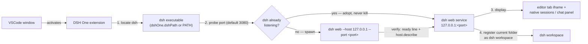

<p align="center">
  
</p>

<h1 align="center">DSH One</h1>

<p align="center">The <a href="https://www.npmjs.com/package/@deepseek-ai/dsh">DeepSeek Harness</a> (dsh) bridge for VSCode: dsh is installed by you, DSH One locates and starts it, embeds the dsh UI in your editor, and turns VSCode into dsh's launcher and display.</p>

<p align="center">
  <a href="https://github.com/imchangchang/dsh-one/actions/workflows/ci.yml"></a>
  <a href="LICENSE"></a>
  <a href="#compatibility"></a>
  <a href="#compatibility"></a>
</p>

<p align="center">
  <a href="#for-users">For users</a> ·
  <a href="#for-developers">For developers</a> ·
  <a href="README.zh-CN.md">简体中文</a>
</p>

> Unofficial community project, not affiliated with DeepSeek. "dsh" belongs to its original project.

---

# For users

## What it does

- **dsh UI inside VSCode** — dsh web runs as a local service; DSH One embeds it in an editor tab (iframe) and provides a native sidebar: sessions list + chat panel.
- **Start or reuse** — the extension probes the configured port and adopts an already-running dsh instance (connect only, never kill); otherwise it spawns its own `dsh web`. No downloads, no runtime management, no update checks — upgrade dsh yourself with `npm update -g`.
- **Workspace sync** — your current folder is registered as the dsh workspace (idempotent), so dsh opens right where you are working.
- **Native sessions list** — grouped by workspace (current folder on top), with search (title / session id), sorting (recent / oldest / title), pin, mark-as-unread, rename, archive, fork, and "open folder" actions. Hover a session row for the `⋯` menu; refresh follows the dsh host event stream automatically.
- **Native chat panel** — markdown rendering, tool calls as compact rows (kimi-cli style action phrases, output folded with expand), inline permission prompts and questions, plan-review cards, todo lists, subagent runs, one-click stop while running.
- **Conversation features** — copy a message, rate it useful/not useful, fork a finished turn into a new session, jump to a subagent session.
- **Composer** — image attachments (thumbnail preview), file attachments (path chips), permission mode picker, model picker, agent preset picker, and a context-usage bar that warns before you run out of room.
- **Send files into the conversation** — right-click any file in the editor or explorer → `DSH One: 发送到当前会话`; images show as thumbnails, other files as path chips.
- **Status bar** — `DSH: running :port / starting / stopped / error`, click to focus the panel.

## Quick start

Prerequisite: install dsh yourself (needs Node ≥ 22):

```bash
npm install -g @deepseek-ai/dsh@next
```

Then install DSH One (from the VS Code Marketplace once published, or `npm run package` → install the `.vsix`) and click the DSH One activity-bar icon. On first use the extension locates dsh and starts the service automatically (it prompts you to install dsh if it is missing). The service listens on `127.0.0.1` only.

## How it works



1. **Locate** — the `dshOne.dshPath` setting wins; otherwise `dsh` is looked up on PATH. If not found, the extension errors out and guides you to install it.
2. **Start or reuse** — the port (default 3080) is probed with `POST /api/host.describe` (with an `rpcId` echo check): a real dsh instance is **adopted and reused, never killed**; otherwise the extension spawns `dsh web --host 127.0.0.1 --port <port>`.
3. **Display** — the full official dsh web UI is embedded in an editor tab via an iframe (`?dsh_embed=vscode`, a reserved embed parameter; not yet consumed by the official UI as of dsh 0.1.1-rc.2), while the sidebar offers native sessions and chat views fed by the dsh event streams.
4. **Workspace preset** — your current folder is registered as the dsh workspace (idempotent), so dsh lands on it via the "most recently active workspace" policy.

## Screenshots

<!-- TODO: 截图占位 — 请在真实 VSCode 中打开 DSH One 面板，截图后放到 assets/screenshots/（如 chat-panel.png、sessions-sidebar.png），并以相对路径替换本段占位。 -->

> Screenshots are pending — they will be captured from a real VSCode window by the maintainer and added under `assets/screenshots/`.

## Using DSH One

- **Sidebar (default)** — the DSH One icon opens the sidebar with the sessions list and the native chat panel. Pick a session to attach it, or start a new one; it opens right in the chat panel.
- **dsh web in an editor tab** — `DSH One: 打开 dsh 页面` opens the full official dsh web UI (iframe) in an editor tab.
- **Common commands** (`Ctrl/Cmd+Shift+P`):

  | Command | Description |
  | --- | --- |
  | `DSH One: 打开面板` | Focus the sidebar chat panel |
  | `DSH One: 打开 dsh 页面` | Open dsh web in an editor tab |
  | `DSH One: 重启服务` / `DSH One: 停止服务` | Restart / stop the dsh service |
  | `DSH One: 显示日志` | Show the extension log |
  | `DSH One: 查看 dsh 安装指南` | Open the official dsh install page |

- **Send a file** — right-click a file in the editor or explorer → `DSH One: 发送到当前会话` to stage it as an attachment in the active conversation.
- **Status bar** — shows the service state; click to focus the panel.

## Settings

| Setting | Type | Default | Description |
| --- | --- | --- | --- |
| `dshOne.dshPath` | `string` | `""` | Path to the dsh executable; empty means look up `dsh` on PATH |
| `dshOne.port` | `number` | `3080` | Service port; `0` lets the OS assign one (adoption probe is skipped) |
| `dshOne.autoStart` | `boolean` | `true` | Start (or reuse) the dsh web service when the extension activates |

## Security and permissions

- **Process safety** — the extension only ever terminates dsh processes it spawned itself; adopted existing instances are never killed.
- **Lifecycle** — dsh is decoupled from the VSCode window: closing or reloading a window does not kill dsh; it is stopped only via `DSH One: 停止服务` / `重启服务` (SIGTERM → SIGKILL on POSIX, `taskkill /T /F` on Windows). A health check (every 30s) detects unexpected exits without popping dialogs.
- **Child environment** — `NODE_OPTIONS` and `ELECTRON_RUN_AS_NODE` (injected by the extension host) are stripped from the dsh child process.
- **Local only** — the service listens on `127.0.0.1`; the webview CSP allows frames from `127.0.0.1` / `localhost` only.
- **No runtime management** — the extension does not download or manage Node.js / dsh, performs no update checks, and reads/writes nothing under `~/.dsh` (that data belongs to dsh itself; the extension only keeps a log file and a pidfile in its own storage).

## Compatibility

- **VS Code**: `^1.96.0` (see `engines` in package.json).
- **dsh**: installed by you via npm (`@deepseek-ai/dsh@next`, Node ≥ 22). `--no-open` requires dsh ≥ 0.1.0-rc.7 (older builds exit on the unknown flag). As of dsh 0.1.1-rc.2 the official UI does not consume `dsh_embed=vscode` (the hidden-sidebar effect does not exist yet).
- **Platforms**: Windows / macOS / Linux (pure TypeScript, zero runtime dependencies — Node built-ins + the vscode API only).

### Known limitations

- **Remote (SSH/WSL/containers) not verified** — the extension declares `extensionKind: ["workspace"]`, so it should run on the remote side with webview `127.0.0.1` relying on VSCode's automatic port forwarding, but this is untested.
- **Multiple windows** — each VSCode window manages its own service; a busy port is shared via adoption, and `port: 0` starts a separate instance per window. dsh UI session restore relies on localStorage (isolated per origin), so `port: 0` (new port every time) breaks restore — prefer a fixed port.

## Uninstall

Uninstall the extension from the VS Code extensions view. dsh itself is installed by you and is not touched; the extension stops only the dsh process it spawned (an adopted instance keeps running), and dsh data (workspaces, sessions) stays in place.

---

# For developers

## Prerequisites

- Node ≥ 22.6 (`npm test` runs `.ts` files directly via `node --test` type stripping)
- VSCode ≥ 1.96 (`engines.vscode`)
- A working dsh on your machine: `npm i -g @deepseek-ai/dsh@next` (the extension no longer downloads runtimes; debugging and manual checks need a real dsh)

## Scripts

| Command | What it does |
| --- | --- |
| `npm run build` | esbuild → `dist/extension.js` (host) + `dist/chatWebview.js` (chat frontend); warnings fail the build |
| `npm run typecheck` | `tsc --noEmit` |
| `npm test` | `node --test test/*.test.ts` — unit tests for `src/pure/` only |
| `npm run package` | build + `vsce package` → `.vsix` |

## Debugging

Open the repo in VSCode, `npm run build`, press F5 — an Extension Development Host window launches with sourcemaps (breakpoints in `src/` work). The dev host activates `dshOne.autoStart` by default; logs are in the "DSH One" output channel. Note the dev host shares `~/.dsh` and the default port with your real VSCode — if 3080 is already taken, the dev host **adopts** the running instance instead of spawning one.

## Architecture

DSH One is a thin bridge: locate dsh → probe/adopt/spawn → embed. The extension host has **zero runtime dependencies** (Node built-ins + vscode API only); the chat webview bundles marked + dompurify via esbuild (nothing loaded at runtime).

```
src/
├── extension.ts        # activate: register commands, views, auto-start
├── server/             # locateDsh, ServerManager (lifecycle), spawnDsh (short-lived
│                       #   launcher), dshRpc (host RPC), muxEvents/hostEvents (WS feeds)
├── ui/                 # webview (iframe tab), chatView (native panel host),
│                       #   sessionsStore/jobsStore (data layers), statusbar
├── pure/               # pure logic, no vscode import (node --test unit-testable):
│                       #   envelope, readyLine, semver, hostFrames, sessionTree, ...
└── test/               # unit tests for src/pure/
```

Key flows:

1. **Locate** — `dshOne.dshPath` wins, else `dsh` on PATH; verified with `dsh --version`.
2. **Probe & adopt** — `POST /api/host.describe` with an `rpcId` echo check. A real dsh on the port → **adopt, never kill**; a foreign service → find a free port (temporary, not persisted); nothing → spawn.
3. **Spawn** — via a short-lived launcher (`ELECTRON_RUN_AS_NODE`) so dsh detaches from the extension host's process tree and survives window reload; identity is written to a pidfile for re-owning on the next activation. `--no-open` is appended only for dsh ≥ 0.1.0-rc.7.
4. **Readiness** — poll `host.describe` every 250ms (or parse the `dsh web: http://127.0.0.1:<port>` ready line when `port: 0`); health-checked every 30s afterwards.
5. **Display** — editor tab shows the iframe `http://127.0.0.1:<port>/?dsh_embed=vscode`; the sidebar chat panel is a native webview fed by the dsh event streams (mux + host) and folded into `ChatState` by `src/pure/conversation.ts`.

The full module map, state model and design decisions (with sources) live in [docs/architecture.md](docs/architecture.md).

## Testing conventions

- **Pure logic** — `src/pure/` must never import `vscode` (that keeps it runnable under `node --test`). When fixing a logic bug there: write a failing test first, fix the code (tests are untouchable during the fix), then turn it green — the bug is pinned into regression.
- **UI** — layout/interaction bugs are not unit-testable: use the browser-rendered webview harness (`ai-visual-validation` skill, screenshot vs expected description) plus a manual check in the dev host.
- **CI** — typecheck + test + build + package + spawn smoke on a 3-OS matrix (`.github/workflows/ci.yml`).

## Releasing

1. Set the real publisher id in `package.json` (the placeholder won't publish).
2. Bump `version` and update `CHANGELOG.md`.
3. `npm run typecheck && npm test && npm run package`, then `npx vsce login <publisher>` / `npx vsce publish`.
4. Before publishing, walk the manual checklist in [docs/development.md](docs/development.md) (no-install-dsh path, adopt-not-kill, status bar states, per-OS spawn/kill).

## Docs

- [docs/architecture.md](docs/architecture.md) — module structure, core flows, design decisions with sources
- [docs/development.md](docs/development.md) — environment, build/debug, release process, manual checklists
- [docs/roadmap.md](docs/roadmap.md) — native frontend roadmap, known gaps, candidate directions

## License

MIT © dsh-one contributors
