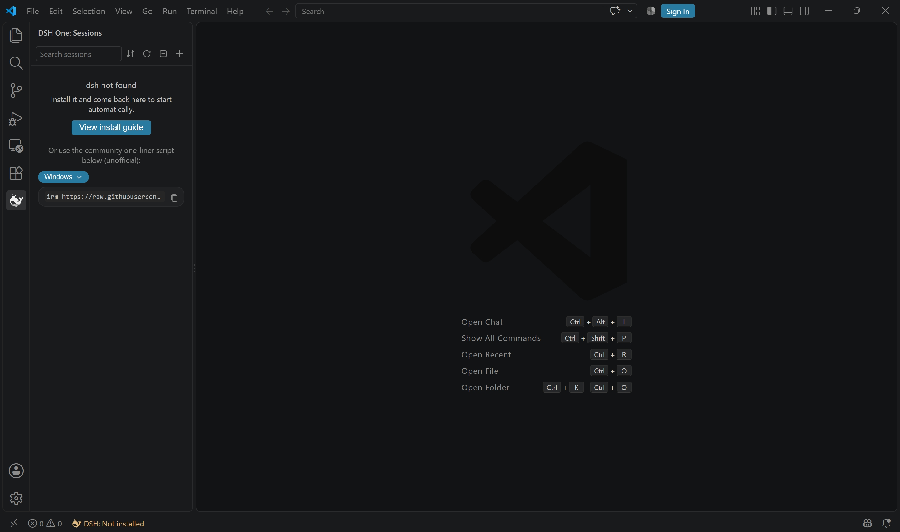
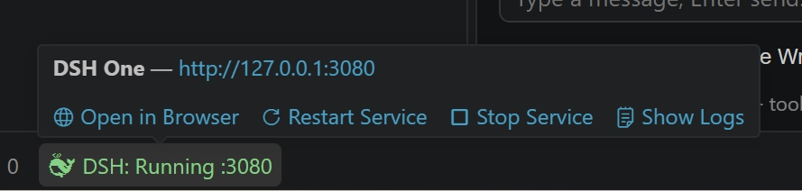
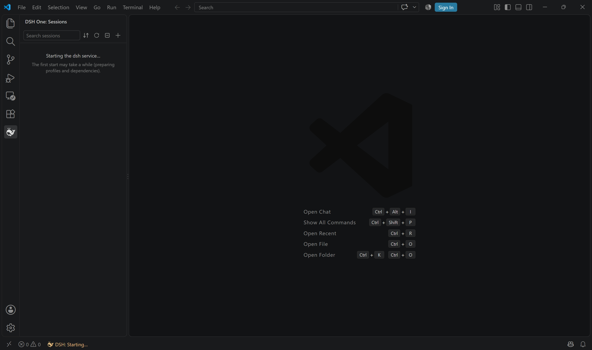
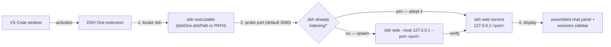

<p align="center">
  
</p>

<h1 align="center">DSH One</h1>

<p align="center">The <a href="https://www.npmjs.com/package/@deepseek-ai/dsh">DeepSeek Harness</a> (dsh) bridge for VS Code: dsh is installed by you, DSH One locates and starts it, embeds the dsh UI in your editor, and turns VS Code into dsh's launcher and display.</p>

<p align="center">
  <a href="https://github.com/imchangchang/dsh-one/actions/workflows/ci.yml"></a>
  <a href="LICENSE"></a>
  <a href="#compatibility"></a>
  <a href="#compatibility"></a>
  <a href="https://github.com/imchangchang/dsh-one/issues?q=label%3Aupstream-watch"></a>
  <a href="https://github.com/imchangchang/dsh-one/issues?q=label%3Aupstream-watch"></a>
</p>

<p align="center">
  <a href="README.zh-CN.md">简体中文</a>
</p>

> Unofficial community project, not affiliated with DeepSeek. "dsh" belongs to its original project.

---

## What it does

- **dsh UI inside VS Code** — dsh web runs as a local service; DSH One assembles the official dsh web chat UI into a VS Code panel, and the sidebar runs dsh's sidebar UI with dsh-one's own sessions tree in place of the official workspaces panel.
- **Start or reuse** — the extension probes the configured port and adopts an already-running dsh instance by connecting to it; otherwise it starts its own `dsh web`. It never downloads or installs dsh for you: the one automatic network call is a silent check of npm's `latest` tag for the status-bar hint, and an upgrade runs in a visible terminal only when you ask for one.
- **Runs where you work** — dsh is started with the folder you have open in VS Code as its working directory, and the sidebar puts the matching dsh workspace first and tags it `vscode`.
- **Sessions sidebar** — dsh-one's own sessions tree: sessions grouped by dsh workspace, with inline rename, pin, mark-as-unread, your own tag groups, multi-select (bulk recycle / archive), a recycle bin, and dsh's session search with the hit text highlighted. Hover a session row for the `⋯` menu, or right-click for the same menu; workspace rows have their own menu (rename, tag group, copy path, archive all its sessions, open the folder in a new window, remove from the list). The tree renders from dsh's live session and workspace data, so it keeps itself current — there is no refresh button.
- **Chat area = the official dsh UI** — the conversation area is the official dsh web UI, the same components the browser page loads, assembled inside VS Code behind a local loopback proxy that handles login and leaves out the plugins that must not load there (the official app frame and the official sidebar — VS Code owns both areas, and dsh-one's own frame plugin takes over). Clicking the DSH One activity-bar icon opens the sidebar and the chat area together; clicking a session in the sidebar focuses the chat area on it.

## Screenshots

> Every image under `docs/screenshot/` was captured before 2.0.0 and shows the 1.x UI: the sidebar, the status bar card and the chat area all look different now (the chat area is the official dsh web UI, the sidebar is the sessions tree described above). They are kept only for the part that did not change — how DSH One sits in the VS Code window.

| Sidebar with dsh missing (1.x) | Status bar hover (1.x) |
| --- | --- |
|  |  |



## Quick start

Install DSH One from the VS Code Marketplace and click the DSH One activity-bar icon. On first use the extension locates dsh and starts the service automatically. The service listens on `127.0.0.1` only.

If dsh is not installed yet, the sidebar says so and offers a **View install guide** button. The guide tab holds the one-line install command (a community script maintained by dsh-one): pick your platform, copy, run. The script reuses a compatible Node (`^22.19` or `>= 24`) or downloads an official portable Node — no admin rights needed — then installs the official `@deepseek-ai/dsh` package. Matching uninstall scripts live in [`install/`](install/).

Prefer to set it up yourself? Install dsh manually instead (needs Node `^22.19` or `>= 24`):

```bash
npm install -g @deepseek-ai/dsh@next
```

## How it works



1. **Locate** — the `dshOne.dshPath` setting wins; otherwise `dsh` is looked up on PATH.
2. **Start or reuse** — the configured port is checked to see whether a dsh instance is already running: if so, the extension connects to it and leaves it alone; otherwise it starts its own `dsh web`, with the folder you have open in VS Code as the working directory.
3. **Display** — the official dsh web chat UI is assembled into a VS Code panel behind a local loopback proxy (login cookie handling + the plugins that must not load there dropped), and the sidebar renders dsh's sidebar UI with dsh-one's sessions tree in place of the official workspaces panel.
4. **Keep in step** — the sidebar tree renders from dsh's live session and workspace data and the status bar follows the service state. DSH One writes into dsh's workspace list only when you add or create a workspace from the sidebar.

## Using DSH One

- **Sidebar (default)** — click the DSH One activity-bar icon: the sidebar opens with the sessions list, and the assembled chat area opens next to it (once per window; if you close it, it stays closed). Pick a session in the sidebar to focus the chat area on it, or start a new session from a workspace row (its hover buttons, or its right-click menu); the toolbar `+` adds a workspace instead.
- **Chat area** — `DSH One: Open Chat` opens the chat area explicitly (this is the same command the default-open path uses).
- **Common commands** (`Ctrl/Cmd+Shift+P`):

  | Command | Description |
  | --- | --- |
  | `DSH One: Open Chat` | Open the chat area |
  | `DSH One: Restart Service` / `DSH One: Stop Service` | Restart / stop the dsh service |
  | `DSH One: Show Status Panel` | Open the status-bar action panel (same as clicking the status-bar item) |
  | `DSH One: Show Logs` | Show the extension log |
  | `DSH One: Copy Local Access Link` / `DSH One: Copy LAN Access Link` | Copy the tokenized dsh web link (the LAN link requires LAN access to be on) |
  | `DSH One: Restart dsh for LAN Access` / `DSH One: Restart dsh for Local-only Access` | Toggle LAN reachability (takes effect with the restart) |
  | `DSH One: Check for dsh Updates` | Compare against the npm `latest` tag; offers Upgrade when a newer version exists |
  | `DSH One: Upgrade dsh` | Run the global install command in the integrated terminal; restart the dsh service afterwards |
  | `DSH One: View dsh Installation Guide` | Open the install guide tab (platform one-liner script + copy, plus a link to the official docs) |

- **Status bar** — shows the service state. **Click** it to open the action panel, which lists the actions available in the current state (open in browser, check for updates or upgrade, copy access link, restart/stop, show logs, …) one action per row; **hover** shows the same set of actions as one link per row. For the instance DSH One manages, the hover also states whether LAN access is on, with a one-click restart to switch it when it is off.

## Settings

| Setting | Type | Default | Description |
| --- | --- | --- | --- |
| `dshOne.dshPath` | `string` | `""` | Path to the dsh executable; empty means look up `dsh` on PATH |
| `dshOne.port` | `number` | `3080` | Service port; `0` lets the OS assign one (adoption probe is skipped) |
| `dshOne.autoStart` | `boolean` | `true` | Start (or reuse) the dsh web service when the extension activates |
| `dshOne.lanAccess` | `boolean` | `false` | Expose the dsh web service to your local network (dsh itself still listens on 127.0.0.1; DSH One forwards from your LAN address). Anyone on the network with the tokenized link can use dsh. Needs dsh `0.1.5-rc.1` or newer — the oldest release this was verified against; on an older dsh the setting is ignored (with a warning) and the service stays local-only |

## Security and permissions

- **Local only by default** — dsh always listens on `127.0.0.1`. With LAN access enabled (`dshOne.lanAccess`, or the one-click restart from the status bar), DSH One forwards from your LAN address to the local service — **anyone on the same network with the tokenized link can use dsh** (it can run commands on your machine). Only enable it on trusted networks and switch back to local-only from the status bar when done.
- **Your dsh data stays dsh's** — sessions, workspaces and dsh settings belong to dsh. DSH One never deletes those files; the actions you take in the UI (archive, recycle, remove a workspace) go through dsh's own services. The extension also keeps files of its own under `~/.dsh`: plugin state (pins, unread marks, tag groups, the recycle bin) in `~/.dsh/dsh-one/<key>.json` — the location and format the dsh plugin convention uses, so an official dsh page reads the same copy — and `~/.dsh/dsh-owned.json`, the record that tells the dsh process it started apart from another window's. It also looks there to find a dsh installed by the community script, creates the folder under `~/.dsh/workspaces/<name>` when you create a workspace from the sidebar, and can open `~/.dsh/settings.yaml` in an editor tab from the settings page. Uninstalling the extension leaves all of it in place.
- **No runtime management** — the extension does not download or manage Node.js / dsh installs; “Check for Updates / Upgrade” only runs npm's global install command in a visible terminal that you can interrupt.
- **Process safety** — adopting an already-running dsh only connects to it and never kills it: `DSH One: Stop Service` / `Restart Service` end the process DSH One started, and nothing else. An instance started outside the extension (in your terminal, or by another VS Code window) is stopped only through `DSH One: Stop External Instance` / `Restart External Instance`, each behind its own confirmation dialog. Closing or reloading the VS Code window does not stop dsh, and neither does uninstalling the extension.

## Compatibility

- **VS Code**: `^1.96.0`.
- **dsh**: installed by you via npm (`@deepseek-ai/dsh@next`, Node `^22.19` or `>= 24`).
- **Platforms**: Windows / macOS / Linux.

### dsh version tracking

A scheduled GitHub Action ([dsh-upstream-watch](.github/workflows/dsh-upstream-watch.yml)) checks for new [dsh releases](https://github.com/deepseek-ai/deepseek-harness/releases) daily; for each new version it runs the automated probe suite (23 checks: the wire protocol, the front-end artifacts the gateway serves — boot contract, combo endpoint, Origin fence —, the client contract surface the assembled UI depends on, and the internal identifiers inside the installed official packages) and files an `upstream-watch` issue with the results. The last two badges above show the latest upstream release and the latest probe outcome; the full test list, per-version readings and known failures live in [docs/dsh-compat-checklist.md](docs/dsh-compat-checklist.md).

**dsh versions.** Measured per version with a whole round of `npm run verify:lab`. The three groups are kept apart on purpose:

| dsh version | Status |
|---|---|
| `0.1.6-alpha.1` | **verified** — 69 suites, 3620 assertions, zero failures. This is the floor of the version gate, and the version the banner tells you to install |
| `0.1.6-alpha.2` | verified — four drifts were found and fixed here (none of them visible to the probes, which only read bytes): the client started adopting the plugin roster the gateway pushes over `/plugins/events`, which reinstated the plugins we block and removed our own (the whole page rendered blank); the session list stopped carrying `current`, which left the sidebar tree with workspaces but no sessions (and the git card without a working directory); the session service dropped `open` / `select` / `clear`, which made clicking a session do nothing; and the `completed` flag moved off the session row into the `sessionStatus` hook, which lost the “finished, not opened yet” dot. A fifth one (fixed in #225) broke the sidebar panel outright: a conversation-area card began waiting for a service the sidebar tree does not provide, so the panel showed the official boot-audit failure instead of the session tree. The whole-round run reads 3580/3583; its two remaining readings are chat-tree settle issues tracked in #226. (Drift record for the earlier `0.1.6-alpha.1` round: the `details` slot was renamed to `rightbar`, new root-level hooks appeared, and the composer's `imageIds` / `addImages` became `attachmentIds` / `addAttachments`.) |
| `0.1.7-alpha.2` | **verified broken** — the official `@deepseek-ai/dsh-client-ui-primitives` renamed its whole icon set from size suffixes to weight suffixes (`IconCloseFill14` → `IconCloseFillMedium` / `IconCloseFillRegular`, and 25 more we import). A name that is gone resolves to `undefined` instead of failing to load, so every slot entry of ours crashes at render (`slot entry crashed in 'sidebar.workspaces': Error: Minified React error #130`) and the sidebar/chat/settings surfaces come up empty. Porting is tracked in #236. The same release also made `__DSH_BOOT__.batches[].url` relative (`plugins/??…` instead of `/plugins/??…`), which broke the mirror's combo fetch — that one is fixed |
| `0.1.5-rc.2` | **verified broken** — 67 of 69 suites pass; the two failures are the startup self-heal never engaging (F-67, same signature as on `0.1.2-rc.1`) and the composer's ＋ missing entirely (F-54: that generation has no official `pickFiles` action) |
| `0.1.2-rc.1` | **verified broken** — 52 of 69 suites pass. That generation has no `openSession` at all, so “make a session the current one” — the main path — does not work (three root causes are listed in #234) |
| every other version | **not tested** — including `0.1.5-rc.3` (npm's `next` tag) and anything at or above `0.2.0` |

**Version gate.** The assembled chat expects dsh `[0.1.6-alpha.1, 0.2.0)`: the floor is the oldest version that passes a whole round, and nothing above the ceiling has been verified. The gate never blocks — a version outside the range gets an info banner at the top of the panel, and the banner now carries the install command to run, not just the range: **no npm dist-tag points at a verified version today** (`latest` = 0.1.5-rc.2 and `next` = 0.1.5-rc.3 both sit below the floor; `alpha` = 0.1.7-alpha.2 is inside the range but broken), so it names the exact version to install (`npm install -g @deepseek-ai/dsh@0.1.6-alpha.1`, the only zero-failure round). One known limitation: the gate is a whole-range check, so a version inside the range that is measured broken — `0.1.7-alpha.2` right now — passes silently.

**On every upstream release, run the checks below** (prerequisites and details in the checklist). The browser lab appears twice on purpose: once on the candidate version, once on the dsh you have installed.

| Check | Command | Covers |
|---|---|---|
| upstream probe | `node scripts/dsh-upstream-watch/probe.mjs --command dsh --expect-version <version>` | wire surface + client contract surface + installed official artifacts: are the slot names, root-level hooks, field/method names and internal identifiers we depend on still there |
| browser verification on the candidate | `npm run verify:lab-version <version>` | does the assembly build up at all **on that version**: four trees boot with no crashed slot and no missing contract. Installs the candidate into a temp dir and runs the lab against it, leaving your installed dsh untouched. This is the gate 0.1.6-alpha.2's blank page walked past — probes read bytes and cannot see it |
| browser verification on your install | `npm run verify:lab` | the same assertions against the dsh on your `PATH`; run it after every change to the assembly |
| host-half verification | `npm run verify:host-half` | the gateway-side plugin half against official dsh |

Who finds what: the probe runs daily in CI and catches renamed slots, hooks and fields before users hit them; the browser lab is the first check for any change to the assembly; VS Code verification (`scripts/dev-ui-test.sh`) is the final authority for host-layer behavior (CSP, clipboard, native menus, webview lifecycle).

| Item | Coverage |
|---|---|
| Startup & auth (ready line, `?token=` cookie exchange, 401 fingerprint) | probe |
| Unary RPC (`session/*`, `workspace/*`, `agentPresets/*`, `commands/*` args shapes) | probe |
| WebSocket streams (`session/follow` snapshot, `session/control` baseline) | probe |
| Client contract surface (slot names, root hooks, field names the assembly depends on) | probe |
| Internal identifiers inside the installed official packages (silent-failure dependencies) | probe |
| Assembled trees on a real gateway (boot, slots filled, no crashed entry) | browser verification — also on the **candidate** version via `verify:lab-version` |
| Host-half plugin against official dsh | `verify:host-half` |
| Live-streaming rendering, approvals/questions through the assembled chat | manual (per-version issue) |
| Session-format migration & rollback, sandbox container regression | manual (per-version issue) |

### Known limitations

- **Windows: subagent / background commands may pop a console window** — when dsh runs without a console (the extension's startup path), Windows gives every child process dsh spawns (bash, pwsh, taskkill, …) its own visible console window. This is an upstream dsh bug ([#1564](https://github.com/deepseek-ai/deepseek-harness/discussions/1564); root causes [#1344](https://github.com/deepseek-ai/deepseek-harness/discussions/1344) and [#1102](https://github.com/deepseek-ai/deepseek-harness/discussions/1102)): a verified patch is proposed upstream but not shipped yet — wait for a dsh release and re-check afterwards.
- **Remote (SSH/WSL/containers) not verified** — the extension supports running on the remote side, but this is untested.
- **Multiple windows** — each VS Code window manages its own service, and a second window on the same port connects to the running instance instead of starting another. With `port: 0` every window gets its own instance and its own port, and the dsh UI then loses its stored session selection (browser storage is keyed per origin) — a fixed port is the better choice.

## Uninstall

Uninstall the extension from the VS Code extensions view. dsh itself is installed by you and is not touched: the extension stops no dsh process when it goes away (stop the service yourself beforehand if you want it down), dsh data (workspaces, sessions) stays in place, and so do the files under `~/.dsh` that DSH One kept.

## Development

Build from source with `npm install && npm run build`. `dist/` and `packages/*/lib/` are build outputs and are not in the repository, so build once before running anything that consumes them (`npm test` and the `verify:*` scripts run the build first themselves). The full guide — npm scripts, debugging, the verification lanes — is in [docs/development.md](docs/development.md).

---

## License

MIT © dsh-one contributors
