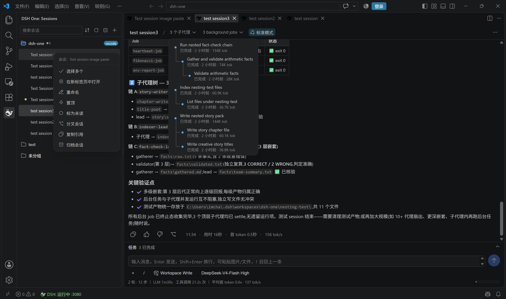
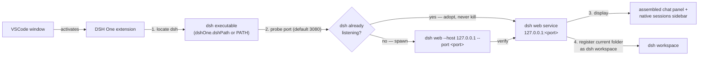

<p align="center">
  
</p>

<h1 align="center">DSH One</h1>

<p align="center">The <a href="https://www.npmjs.com/package/@deepseek-ai/dsh">DeepSeek Harness</a> (dsh) bridge for VSCode: dsh is installed by you, DSH One locates and starts it, embeds the dsh UI in your editor, and turns VSCode into dsh's launcher and display.</p>

<p align="center">
  <a href="https://github.com/imchangchang/dsh-one/actions/workflows/ci.yml"></a>
  <a href="LICENSE"></a>
  <a href="#compatibility"></a>
  <a href="#compatibility"></a>
  <a href="https://github.com/imchangchang/dsh-one/issues?q=label%3Aupstream-watch"></a>
  <a href="https://github.com/imchangchang/dsh-one/issues?q=label%3Aupstream-watch"></a>
</p>

<p align="center">
  <a href="README.zh-CN.md">简体中文</a>
</p>

> Unofficial community project, not affiliated with DeepSeek. "dsh" belongs to its original project.

---

## What it does

- **dsh UI inside VSCode** — dsh web runs as a local service; DSH One assembles the official dsh web chat UI into a VS Code panel and provides a native sidebar with the sessions list.
- **Start or reuse** — the extension probes the configured port and adopts an already-running dsh instance (connect only, never kill); otherwise it spawns its own `dsh web`. No downloads, no runtime management, no update checks — upgrade dsh yourself with `npm update -g`.
- **Workspace sync** — your current folder is registered as the dsh workspace (idempotent), so dsh opens right where you are working.
- **Native sessions list** — grouped by workspace (current folder on top), with search (title / session id), sorting (recent / oldest / title), pin, mark-as-unread, rename, archive, fork, and "open folder" actions. Hover a session row for the `⋯` menu; refresh follows the dsh host event stream automatically.
- **Assembled chat area** — the conversation area is the official dsh web UI (same components as the browser page), assembled inside VS Code behind a local loopback proxy that handles login and filters out the official frame/sidebar plugins. Clicking the DSH One activity-bar icon opens the sidebar and the chat area together; clicking a session in the sidebar focuses the chat area.
- **Status bar** — `DSH: running :port / starting / stopped / error`, click to open the dsh page in your browser.

## Screenshots

> The images below show host chrome (sidebar, status bar, install guidance); the chat-area screenshots are being refreshed after the move to the assembled chat area.

| First-run guidance when dsh is missing | Sessions sidebar |
| --- | --- |
|  |  |


## Quick start

Install DSH One from the VS Code Marketplace and click the DSH One activity-bar icon. On first use the extension locates dsh and starts the service automatically. The service listens on `127.0.0.1` only.

If dsh is not installed yet, the sidebar shows a one-click install command (a community script maintained by dsh-one, shown in the screenshot above): pick your platform, copy, run. The script reuses a compatible Node (≥ 22.19 or ≥ 24) or downloads an official portable Node — no admin rights needed — then installs the official `@deepseek-ai/dsh` package. Matching uninstall scripts live in [`install/`](install/).

Prefer to set it up yourself? Install dsh manually instead (needs Node ≥ 22):

```bash
npm install -g @deepseek-ai/dsh@next
```

## How it works



1. **Locate** — the `dshOne.dshPath` setting wins; otherwise `dsh` is looked up on PATH.
2. **Start or reuse** — the configured port is checked to see whether a real dsh instance is already running: if so, it is **adopted and reused, never killed**; otherwise the extension starts its own `dsh web`.
3. **Display** — the official dsh web chat UI is assembled into a VS Code panel behind a local loopback proxy (login cookie handling + official frame/sidebar plugins filtered out), while the sidebar offers the native sessions list fed by the dsh event streams.
4. **Workspace preset** — your current folder is registered as the dsh workspace, so dsh opens right where you are working.

## Using DSH One

- **Sidebar (default)** — click the DSH One activity-bar icon: the sidebar opens with the sessions list, and the assembled chat area opens next to it (once per window; if you close it, it stays closed). Pick a session in the sidebar to focus the chat area on it, or start a new one from the `+` menu.
- **Assembled chat** — `DSH One: Open Assembled Chat` opens the chat area explicitly (this is the same command the default-open path uses).
- **Common commands** (`Ctrl/Cmd+Shift+P`):

  | Command | Description |
  | --- | --- |
  | `DSH One: Open Assembled Chat` | Open the assembled chat area |
  | `DSH One: Restart Service` / `DSH One: Stop Service` | Restart / stop the dsh service |
  | `DSH One: Show Logs` | Show the extension log |
  | `DSH One: View dsh Installation Guide` | Open the official dsh install page |

- **Status bar** — shows the service state; click to open the dsh page in your browser.

## Settings

| Setting | Type | Default | Description |
| --- | --- | --- | --- |
| `dshOne.dshPath` | `string` | `""` | Path to the dsh executable; empty means look up `dsh` on PATH |
| `dshOne.port` | `number` | `3080` | Service port; `0` lets the OS assign one (adoption probe is skipped) |
| `dshOne.autoStart` | `boolean` | `true` | Start (or reuse) the dsh web service when the extension activates |

## Security and permissions

- **Local only** — the service listens on `127.0.0.1`; nothing is exposed to your network.
- **Your data stays with dsh** — DSH One does not read or write `~/.dsh`; that data belongs to dsh. Uninstalling the extension never touches your sessions or workspaces.
- **No runtime management** — the extension does not download or manage Node.js / dsh and performs no update checks; upgrade dsh yourself.
- **Process safety** — the extension only stops dsh processes it started itself; an already-running dsh instance is reused, never killed. Closing or reloading the VSCode window does not stop dsh.

## Compatibility

- **VS Code**: `^1.96.0`.
- **dsh**: installed by you via npm (`@deepseek-ai/dsh@next`, Node ≥ 22).
- **Platforms**: Windows / macOS / Linux.

### dsh version tracking

A scheduled GitHub Action ([dsh-upstream-watch](.github/workflows/dsh-upstream-watch.yml)) checks for new [dsh releases](https://github.com/deepseek-ai/deepseek-harness/releases) daily; for each new version it runs the automated probe suite (18 checks: the wire protocol plus the client contract surface the assembled UI depends on) and files an `upstream-watch` issue with the results. The last two badges above show the latest upstream release and the latest probe outcome; the full test list (automated + manual items) lives in [docs/dsh-compat-checklist.md](docs/dsh-compat-checklist.md).

**Tested versions.** Two dsh versions have been verified end to end:

| dsh version | Status |
|---|---|
| `0.1.2-rc.1` | tested — the baseline every verification lane was built against |
| `0.1.6-alpha.1` | tested — three drifts were found and fixed here: the `details` slot was renamed to `rightbar`, new root-level hooks appeared, and the composer's `imageIds` / `addImages` were renamed to `attachmentIds` / `addAttachments` |
| any other version in `[0.1.2-rc.1, 0.2.0)` | **not tested** — see the gate note below |

**Version gate.** The assembled chat expects dsh `[0.1.2-rc.1, 0.2.0)`: older builds lack the browser-session auth and loader protocol the assembly uses, newer ones are unverified. The gate never blocks — a version outside the range gets an info banner at the top of the panel. Because it is a whole-range check, a 0.1.6 release passes silently even though drift inside the range is proven (the row above).

**On every upstream release, run three checks** (prerequisites and details in the checklist):

| Check | Command | Covers |
|---|---|---|
| upstream probe | `node scripts/dsh-upstream-watch/probe.mjs --command dsh --expect-version <version>` | wire surface + client contract surface: are the slot names, root-level hooks and field/method names we depend on still there |
| browser verification | `npm run verify:lab` | the four assembled trees boot on a real gateway with no crashed slot and no missing contract |
| host-half verification | `npm run verify:host-half` | the gateway-side plugin half against official dsh |

Who finds what: the probe runs daily in CI and catches renamed slots, hooks and fields before users hit them; the browser lab is the first check for any change to the assembly; VS Code verification (`scripts/dev-ui-test.sh`) is the final authority for host-layer behavior (CSP, clipboard, native menus, webview lifecycle).

| Item | Coverage |
|---|---|
| Startup & auth (ready line, `?token=` cookie exchange, 401 fingerprint) | probe |
| Unary RPC (`session/*`, `workspace/*`, `agentPresets/*`, `commands/*` args shapes) | probe |
| WebSocket streams (`session/follow` snapshot, `session/control` baseline) | probe |
| Client contract surface (slot names, root hooks, field names the assembly depends on) | probe |
| Assembled trees on a real gateway (boot, slots filled, no crashed entry) | browser verification |
| Host-half plugin against official dsh | `verify:host-half` |
| Live-streaming rendering, approvals/questions through the assembled chat | manual (per-version issue) |
| Session-format migration & rollback, sandbox container regression | manual (per-version issue) |

### Known limitations

- **Windows: subagent / background commands may pop a console window** — when dsh runs without a console (the extension's startup path), Windows gives every child process dsh spawns (bash, pwsh, taskkill, …) its own visible console window. This is an upstream dsh bug ([#1564](https://github.com/deepseek-ai/deepseek-harness/discussions/1564); root causes [#1344](https://github.com/deepseek-ai/deepseek-harness/discussions/1344) and [#1102](https://github.com/deepseek-ai/deepseek-harness/discussions/1102)): a verified patch is proposed upstream but not shipped yet — wait for a dsh release and re-check afterwards.
- **Remote (SSH/WSL/containers) not verified** — the extension supports running on the remote side, but this is untested.
- **Multiple windows** — each VSCode window manages its own service; a busy port is shared, while `port: 0` starts a separate instance per window (session restore may break — prefer a fixed port).

## Uninstall

Uninstall the extension from the VS Code extensions view. dsh itself is installed by you and is not touched; the extension stops only the dsh process it spawned (an adopted instance keeps running), and dsh data (workspaces, sessions) stays in place.

---

## License

MIT © dsh-one contributors
