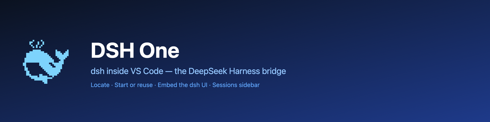
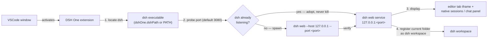

<p align="center">
  
</p>

<h1 align="center">DSH One</h1>

<p align="center">The <a href="https://www.npmjs.com/package/@deepseek-ai/dsh">DeepSeek Harness</a> (dsh) bridge for VSCode: dsh is installed by you, DSH One locates and starts it, embeds the dsh UI in your editor, and turns VSCode into dsh's launcher and display.</p>

<p align="center">
  <a href="https://github.com/imchangchang/dsh-one/actions/workflows/ci.yml"></a>
  <a href="LICENSE"></a>
  <a href="#compatibility"></a>
  <a href="#compatibility"></a>
</p>

<p align="center">
  <a href="README.zh-CN.md">简体中文</a>
</p>

> Unofficial community project, not affiliated with DeepSeek. "dsh" belongs to its original project.

---

## What it does

- **dsh UI inside VSCode** — dsh web runs as a local service; DSH One embeds it in an editor tab (iframe) and provides a native sidebar: sessions list + chat panel.
- **Start or reuse** — the extension probes the configured port and adopts an already-running dsh instance (connect only, never kill); otherwise it spawns its own `dsh web`. No downloads, no runtime management, no update checks — upgrade dsh yourself with `npm update -g`.
- **Workspace sync** — your current folder is registered as the dsh workspace (idempotent), so dsh opens right where you are working.
- **Native sessions list** — grouped by workspace (current folder on top), with search (title / session id), sorting (recent / oldest / title), pin, mark-as-unread, rename, archive, fork, and "open folder" actions. Hover a session row for the `⋯` menu; refresh follows the dsh host event stream automatically.
- **Native chat panel** — markdown rendering, tool calls as compact rows (action phrases, output folded with expand), inline permission prompts and questions, plan-review cards, todo lists, subagent runs, one-click stop while running.
- **Conversation features** — copy a message, rate it useful/not useful, fork a finished turn into a new session, jump to a subagent session.
- **Composer** — image attachments (thumbnail preview), file attachments (path chips), permission mode picker, model picker, agent preset picker, and a context-usage bar that warns before you run out of room.
- **Send files into the conversation** — right-click any file in the editor or explorer → `DSH One: Send to Current Session`; images show as thumbnails, other files as path chips.
- **Status bar** — `DSH: running :port / starting / stopped / error`, click to focus the panel.

## Quick start

Prerequisite: install dsh yourself (needs Node ≥ 22):

```bash
npm install -g @deepseek-ai/dsh@next
```

Then install DSH One from the VS Code Marketplace and click the DSH One activity-bar icon. On first use the extension locates dsh and starts the service automatically (it prompts you to install dsh if it is missing). The service listens on `127.0.0.1` only.

## How it works



1. **Locate** — the `dshOne.dshPath` setting wins; otherwise `dsh` is looked up on PATH.
2. **Start or reuse** — the configured port is checked to see whether a real dsh instance is already running: if so, it is **adopted and reused, never killed**; otherwise the extension starts its own `dsh web`.
3. **Display** — the full official dsh web UI is embedded in an editor tab, while the sidebar offers native sessions and chat views fed by the dsh event streams.
4. **Workspace preset** — your current folder is registered as the dsh workspace, so dsh opens right where you are working.

## Using DSH One

- **Sidebar (default)** — the DSH One icon opens the sidebar with the sessions list and the native chat panel. Pick a session to attach it, or start a new one; it opens right in the chat panel.
- **dsh web in an editor tab** — `DSH One: Open dsh Page` opens the full official dsh web UI (iframe) in an editor tab.
- **Common commands** (`Ctrl/Cmd+Shift+P`):

  | Command | Description |
  | --- | --- |
  | `DSH One: Open Panel` | Focus the sidebar chat panel |
  | `DSH One: Open dsh Page` | Open dsh web in an editor tab |
  | `DSH One: Restart Service` / `DSH One: Stop Service` | Restart / stop the dsh service |
  | `DSH One: Show Logs` | Show the extension log |
  | `DSH One: View dsh Installation Guide` | Open the official dsh install page |

- **Send a file** — right-click a file in the editor or explorer → `DSH One: Send to Current Session` to stage it as an attachment in the active conversation.
- **Status bar** — shows the service state; click to focus the panel.

## Settings

| Setting | Type | Default | Description |
| --- | --- | --- | --- |
| `dshOne.dshPath` | `string` | `""` | Path to the dsh executable; empty means look up `dsh` on PATH |
| `dshOne.port` | `number` | `3080` | Service port; `0` lets the OS assign one (adoption probe is skipped) |
| `dshOne.autoStart` | `boolean` | `true` | Start (or reuse) the dsh web service when the extension activates |

## Security and permissions

- **Local only** — the service listens on `127.0.0.1`; nothing is exposed to your network.
- **Your data stays with dsh** — DSH One does not read or write `~/.dsh`; that data belongs to dsh. Uninstalling the extension never touches your sessions or workspaces.
- **No runtime management** — the extension does not download or manage Node.js / dsh and performs no update checks; upgrade dsh yourself.
- **Process safety** — the extension only stops dsh processes it started itself; an already-running dsh instance is reused, never killed. Closing or reloading the VSCode window does not stop dsh.

## Compatibility

- **VS Code**: `^1.96.0`.
- **dsh**: installed by you via npm (`@deepseek-ai/dsh@next`, Node ≥ 22).
- **Platforms**: Windows / macOS / Linux.

### Known limitations

- **Windows: subagent / background commands may pop a console window** — when dsh runs without a console (the extension's startup path), Windows gives every child process dsh spawns (bash, pwsh, taskkill, …) its own visible console window. This is an upstream dsh bug ([#1564](https://github.com/deepseek-ai/deepseek-harness/discussions/1564); root causes [#1344](https://github.com/deepseek-ai/deepseek-harness/discussions/1344) and [#1102](https://github.com/deepseek-ai/deepseek-harness/discussions/1102)): a verified patch is proposed upstream but not shipped yet — wait for a dsh release and re-check afterwards.
- **Remote (SSH/WSL/containers) not verified** — the extension supports running on the remote side, but this is untested.
- **Multiple windows** — each VSCode window manages its own service; a busy port is shared, while `port: 0` starts a separate instance per window (session restore may break — prefer a fixed port).

## Uninstall

Uninstall the extension from the VS Code extensions view. dsh itself is installed by you and is not touched; the extension stops only the dsh process it spawned (an adopted instance keeps running), and dsh data (workspaces, sessions) stays in place.

---

## License

MIT © dsh-one contributors
