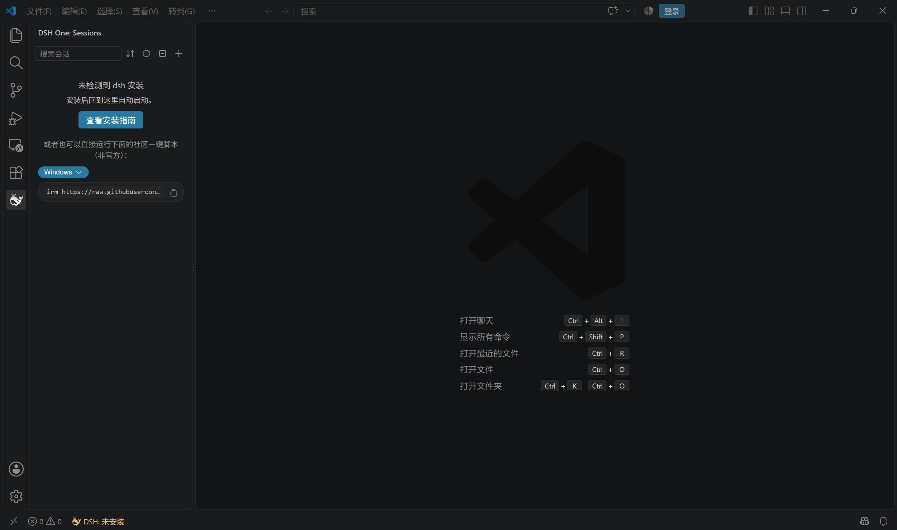
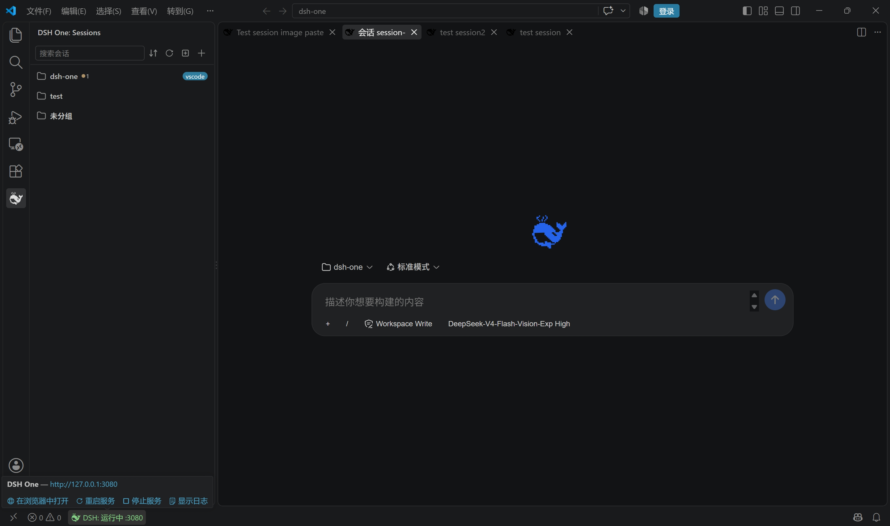
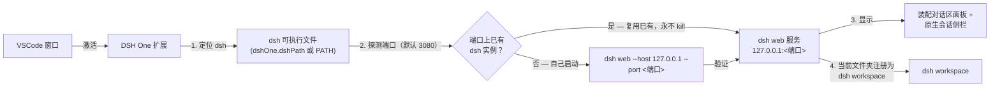

<p align="center">
  
</p>

<h1 align="center">DSH One</h1>

<p align="center"><a href="https://www.npmjs.com/package/@deepseek-ai/dsh">DeepSeek Harness</a>（dsh）与 VSCode 之间的桥接插件：dsh 由你自己安装，DSH One 负责定位并启动它，把 dsh 界面嵌进 VSCode，并把当前文件夹预置为 dsh workspace。VSCode 就是 dsh 的启动器和显示器。</p>

<p align="center">
  <a href="https://github.com/imchangchang/dsh-one/actions/workflows/ci.yml"></a>
  <a href="LICENSE"></a>
  <a href="#兼容性"></a>
  <a href="#兼容性"></a>
  <a href="https://github.com/imchangchang/dsh-one/issues?q=label%3Aupstream-watch"></a>
  <a href="https://github.com/imchangchang/dsh-one/issues?q=label%3Aupstream-watch"></a>
</p>

<p align="center">
  <a href="README.md">English</a>
</p>

> 非官方社区项目，与 DeepSeek 官方无关。"dsh" 名称归其原项目所有。

---

## 能做什么

- **dsh 界面嵌进 VSCode**：dsh web 以本地服务运行，DSH One 把官方 dsh web 聊天界面装配进 VS Code 面板，并提供原生侧边栏：会话列表。
- **启动或复用**：扩展探测配置端口，已有 dsh 实例就直接复用（只连接，永不 kill）；否则自己 spawn `dsh web`。不下载、不管理运行时、不做更新检查——升级 dsh 由你自己 `npm update -g`。
- **workspace 同步**：把当前文件夹注册为 dsh workspace（幂等），dsh 打开就落在你正在工作的目录。
- **原生会话列表**：按 workspace 分组（当前文件夹置顶），支持搜索（标题 / 会话 ID）、排序（最近 / 最早 / 按标题）、置顶、标为未读、重命名、归档、分叉、"打开文件夹"等操作；会话行 hover 出「⋯」菜单，列表订阅 dsh host 事件流自动刷新。
- **装配对话区**：对话区就是官方 dsh web 界面（与浏览器页面同一套组件），经本地 loopback 代理装配进 VS Code——代理负责登录 cookie，并过滤掉官方外框/侧栏插件。点活动栏 DSH One 图标，侧边栏和对话区一起打开；点侧栏会话，对话区随即聚焦。
- **状态栏**：显示 `DSH: 运行中 :端口 / 启动中 / 已停止 / 错误`，点击后在系统浏览器打开 dsh 网页。

## 截图

> 下列截图展示宿主界面（侧边栏、状态栏、安装引导）；对话区截图随装配对话区切换后统一更新。

| 未安装 dsh 时的首次使用引导 | 会话右键菜单 |
| --- | --- |
|  |  |



## 快速开始

从 VS Code 扩展市场安装 DSH One，点击活动栏的 DSH One 图标。首次使用会自动定位 dsh 并启动服务。服务只监听 `127.0.0.1`。

还没装 dsh 时，侧边栏会直接给出一条一键安装命令（社区脚本，由 dsh-one 维护，见上方截图）：选平台、复制、运行即可。脚本会复用兼容的 Node（≥ 22.19 或 ≥ 24），或自动下载官方便携版 Node——不需要管理员权限——然后安装官方 `@deepseek-ai/dsh` 包。配套的卸载脚本在 [`install/`](install/)。

想自己装也行（需要 Node ≥ 22）：

```bash
npm install -g @deepseek-ai/dsh@next
```

## 工作原理



1. **定位**：`dshOne.dshPath` 配置优先，否则在 PATH 上找 `dsh`。
2. **启动或复用**：先探测配置端口上有没有已经在跑的真 dsh：有就直接**复用**（只连接，永不 kill）；没有就自己启动 `dsh web`。
3. **显示**：官方 dsh web 聊天界面经本地 loopback 代理装配进 VS Code 面板（代理负责登录 cookie，并过滤官方外框/侧栏插件），侧边栏提供原生会话列表，由 dsh 事件流驱动。
4. **workspace 预置**：把当前文件夹注册为 dsh workspace，dsh 直接落在你正在工作的目录。

## 使用指南

- **侧边栏（默认）**：点击活动栏的 DSH One 图标——侧边栏打开会话列表，装配对话区同时在旁边自动打开（每个窗口只自动开一次；手动关掉后不再强开）。点侧栏会话即聚焦对话区，也可用「+」菜单新建会话。
- **装配对话区**：`DSH One: 打开装配对话区` 显式打开对话区（默认打开走的也是这条命令）。
- **常用命令**（`Ctrl/Cmd+Shift+P`）：

  | 命令 | 说明 |
  | --- | --- |
  | `DSH One: 打开装配对话区` | 打开装配对话区 |
  | `DSH One: 重启服务` / `DSH One: 停止服务` | 重启 / 停止 dsh 服务 |
  | `DSH One: 显示日志` | 查看扩展日志 |
  | `DSH One: 查看 dsh 安装指南` | 打开官方 dsh 安装页 |

- **状态栏**：显示服务状态，点击后在系统浏览器打开 dsh 网页。

## 配置项

| 配置 | 类型 | 默认 | 说明 |
| --- | --- | --- | --- |
| `dshOne.dshPath` | `string` | `""` | dsh 可执行文件路径；留空则在 PATH 上查找 `dsh` |
| `dshOne.port` | `number` | `3080` | 服务端口；`0` 表示由 OS 分配（此时跳过复用探测） |
| `dshOne.autoStart` | `boolean` | `true` | 扩展激活时自动启动（或复用）dsh web 服务 |

## 安全与权限

- **仅本机**：服务只监听 `127.0.0.1`，不会暴露到你的网络。
- **数据归 dsh**：DSH One 不读写 `~/.dsh`，那是 dsh 自己的数据；卸载插件也不会动你的会话和 workspace。
- **不管理运行时**：插件不下载、不管理 Node.js / dsh，也不做更新检查；升级 dsh 由你自己操作。
- **进程安全**：插件只停止自己启动的 dsh 进程，已有实例只会复用、绝不会被杀；关闭或重载 VSCode 窗口也不会停止 dsh。

## 兼容性

- **VS Code**：`^1.96.0`。
- **dsh**：由你通过 npm 安装（`@deepseek-ai/dsh@next`，Node ≥ 22）。
- **平台**：Windows / macOS / Linux。

### dsh 版本兼容跟踪

定时 GitHub Action（[dsh-upstream-watch](.github/workflows/dsh-upstream-watch.yml)）每天检查 [dsh 上游 release](https://github.com/deepseek-ai/deepseek-harness/releases)：发现新版本即在 CI 上自动跑一轮 wire 协议兼容性探针（14 项，覆盖 dsh-one 依赖的启动/认证/unary RPC/WebSocket 接口面），并建 `upstream-watch` issue 记录结果。顶部最后两个徽章分别显示上游最新 release 与最近一次探针结论；完整测试清单（自动化 + 人工项）见 [docs/dsh-compat-checklist.md](docs/dsh-compat-checklist.md)。DSH One 目标版本为 dsh **0.1.2-rc.1** 与 GitHub-only 的 **0.1.3-alpha.1** wire（`commands/execute` 的 `submittedAttachments`、`session/follow` 的 `assistantStream` opt-in），同时仍服务 0.1.1 legacy wire——按版本探测隔离，老版本零改动。

| 测试项 | 覆盖方式 |
|---|---|
| 启动与认证（就绪行、`?token=` 换 cookie、401 指纹） | 探针 |
| unary RPC（`session/*`、`workspace/*`、`agentPresets/*`、`commands/*` 参数形状） | 探针 |
| WebSocket 流（`session/follow` snapshot、`session/control` baseline） | 探针 |
| 装配对话区（官方界面）的流式渲染、审批/提问卡 | 人工（按版本 issue） |
| 会话格式迁移与回滚、沙盒容器回归 | 人工（按版本 issue） |

### 已知限制

- **Windows：派生子任务 / 后台命令可能弹出控制台窗口**：当 dsh 以无控制台方式运行（扩展的启动路径即是）时，Windows 会给 dsh spawn 的每个子进程（bash、pwsh、taskkill 等）分配一个可见的控制台窗口。这是 dsh 上游的问题（[#1564](https://github.com/deepseek-ai/deepseek-harness/discussions/1564)，根因见 [#1344](https://github.com/deepseek-ai/deepseek-harness/discussions/1344) 与 [#1102](https://github.com/deepseek-ai/deepseek-harness/discussions/1102)）：上游已有验证过的补丁但尚未发版——等 dsh 新版本发布后再复核一次。
- **Remote（SSH/WSL/容器）未验证**：插件支持在远端运行，但尚未实际测试。
- **多窗口**：每个 VSCode 窗口各自管理服务；端口被占用时共享已有实例，端口为 0 时各窗口各自起实例（会话恢复可能失效——建议固定端口）。

## 卸载

在 VS Code 扩展视图中卸载本扩展即可。dsh 本体由你自行安装，不受影响；扩展只会停止自己 spawn 的 dsh 进程（复用的实例继续运行），dsh 数据（workspace、会话）原样保留。

---

## License

MIT © dsh-one contributors
