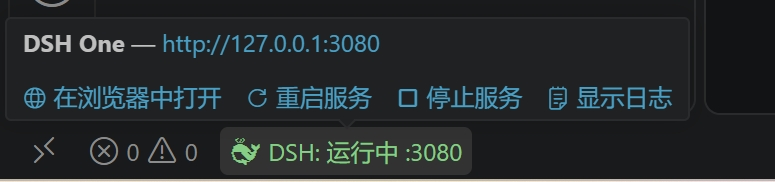
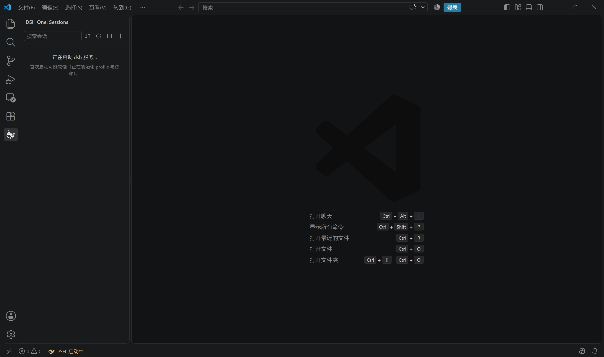
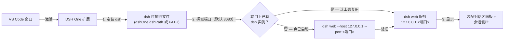

<p align="center">
  
</p>

<h1 align="center">DSH One</h1>

<p align="center"><a href="https://www.npmjs.com/package/@deepseek-ai/dsh">DeepSeek Harness</a>（dsh）与 VS Code 之间的桥接插件：dsh 由你自己安装，DSH One 负责定位并启动它，把 dsh 界面嵌进 VS Code，并以你在 VS Code 里打开的文件夹作为 dsh 的工作目录。VS Code 就是 dsh 的启动器和显示器。</p>

<p align="center">
  <a href="https://github.com/imchangchang/dsh-one/actions/workflows/ci.yml"></a>
  <a href="LICENSE"></a>
  <a href="#兼容性"></a>
  <a href="#兼容性"></a>
  <a href="https://github.com/imchangchang/dsh-one/issues?q=label%3Aupstream-watch"></a>
  <a href="https://github.com/imchangchang/dsh-one/issues?q=label%3Aupstream-watch"></a>
</p>

<p align="center">
  <a href="README.md">English</a>
</p>

> 非官方社区项目，与 DeepSeek 官方无关。"dsh" 名称归其原项目所有。

---

## 能做什么

- **dsh 界面嵌进 VS Code**：dsh web 以本地服务运行，DSH One 把官方 dsh web 聊天界面装配进 VS Code 面板；侧边栏跑的是 dsh 的侧栏界面，其中官方的工作区面板换成了我们自研的会话树。
- **启动或复用**：扩展探测配置端口，端口上已有 dsh 就连上去复用；没有就自己起 `dsh web`。它不会替你下载或安装 dsh：唯一的自动联网动作是静默查一次 npm 上的 `latest` 版本（供状态栏提示），升级只在你点了之后、在可见的终端里跑。
- **跟着你在的目录跑**：dsh 启动时以你在 VS Code 里打开的文件夹为工作目录；侧边栏把对应的 dsh 工作区排到最前，并给它打上 `vscode` 标签。
- **会话侧边栏**：会话树是我们自研的——按 dsh 工作区分组，支持行内重命名、置顶、标为未读、自定义标签组、多选（批量移入回收站 / 归档）、回收站，以及 dsh 的会话搜索（命中的文字高亮）。会话行悬停出「⋯」菜单，右键是同一份菜单；工作区行另有自己的菜单（重命名、归组、复制路径、归档该工作区全部会话、在新窗口打开文件夹、从列表移除）。树的数据直接来自 dsh 的会话与工作区服务，自己保持最新——没有刷新按钮。
- **对话区 = 官方 dsh 界面**：对话区就是官方 dsh web 界面（与浏览器页面同一套组件），经本地 loopback 代理装配进 VS Code——代理负责登录 cookie，并挡下不该在这一页加载的插件（官方外框与官方侧栏：这两块归 VS Code，由我们自研的外框插件接管）。点活动栏 DSH One 图标，侧边栏和对话区一起打开；点侧栏会话，对话区随即聚焦到那条会话。

## 截图

> `docs/screenshot/` 下的截图都拍于 2.0.0 之前，展示的是 1.x 界面：侧边栏、状态栏卡片与对话区现在都不一样了（对话区是官方 dsh web 界面，侧边栏是上面讲的那棵会话树）。保留它们，只因为「DSH One 在 VS Code 窗口里的位置」这部分没变。

| 未安装 dsh 时的侧边栏（1.x） | 状态栏悬停卡（1.x） |
| --- | --- |
|  |  |



## 快速开始

从 VS Code 扩展市场安装 DSH One，点击活动栏的 DSH One 图标。首次使用会自动定位 dsh 并启动服务。服务只监听 `127.0.0.1`。

还没装 dsh 时，侧边栏会说明这一点，并给一个「查看安装指南」按钮。安装引导页里有那条一键安装命令（社区脚本，由 dsh-one 维护）：选平台、复制、运行即可。脚本会复用兼容的 Node（`^22.19` 或 `>= 24`），或自动下载官方便携版 Node——不需要管理员权限——然后安装官方 `@deepseek-ai/dsh` 包。配套的卸载脚本在 [`install/`](install/)。

想自己装也行（需要 Node `^22.19` 或 `>= 24`）：

```bash
npm install -g @deepseek-ai/dsh@next
```

## 工作原理



1. **定位**：`dshOne.dshPath` 配置优先，否则在 PATH 上找 `dsh`。
2. **启动或复用**：先探测配置端口上有没有已经在跑的 dsh：有就连上去、不碰它；没有就自己启动 `dsh web`，工作目录取你在 VS Code 里打开的文件夹。
3. **显示**：官方 dsh web 聊天界面经本地 loopback 代理装配进 VS Code 面板（代理负责登录 cookie，并挡下不该在这一页加载的插件）；侧边栏渲染 dsh 的侧栏界面，其中官方的工作区面板换成我们自研的会话树。
4. **保持同步**：会话树的数据来自 dsh 的会话与工作区服务，状态栏跟随服务状态；只有你从侧边栏添加或创建工作区时，DSH One 才会往 dsh 的工作区列表里写东西。

## 使用指南

- **侧边栏（默认）**：点击活动栏的 DSH One 图标——侧边栏打开会话列表，装配对话区同时在旁边自动打开（每个窗口只自动开一次；手动关掉后不再强开）。点侧栏会话即聚焦对话区；新建会话在工作区行上（悬停出现的按钮，或右键菜单），顶栏那个「+」是添加工作区。
- **对话区**：`DSH One: 打开对话区` 显式打开对话区（默认打开走的也是这条命令）。
- **常用命令**（`Ctrl/Cmd+Shift+P`）：

  | 命令 | 说明 |
  | --- | --- |
  | `DSH One: 打开对话区` | 打开对话区 |
  | `DSH One: 重启服务` / `DSH One: 停止服务` | 重启 / 停止 dsh 服务 |
  | `DSH One: 显示状态面板` | 打开状态栏的动作面板（等同点击状态栏那一项） |
  | `DSH One: 显示日志` | 查看扩展日志 |
  | `DSH One: 复制本机访问链接` / `DSH One: 复制局域网访问链接` | 复制带 token 的 dsh 网页链接（局域网链接需先开启局域网访问） |
  | `DSH One: 重启 dsh 为局域网访问` / `DSH One: 重启 dsh 为仅本机访问` | 切换局域网可达性（重启服务生效） |
  | `DSH One: 检查 dsh 更新` | 拿 npm 上的 `latest` 版本跟当前 dsh 比；有新版可直接点「升级」 |
  | `DSH One: 升级 dsh` | 在集成终端里跑全局安装命令；装完重启 dsh 服务即可生效 |
  | `DSH One: 查看 dsh 安装指南` | 打开安装引导页（按平台的一键脚本 + 复制，另附官方文档入口） |

- **状态栏**：显示服务状态。**点击**打开动作面板——按当前状态给出可用动作（打开浏览器、检查更新或升级、复制访问链接、重启/停止服务、显示日志等），一个动作一行；**悬停**也给出同一套动作（一行一个链接）。对 DSH One 自己管的实例，悬停气泡里还会标明局域网访问是开是关，关着的时候有一键「重启为局域网访问」。

## 配置项

| 配置 | 类型 | 默认 | 说明 |
| --- | --- | --- | --- |
| `dshOne.dshPath` | `string` | `""` | dsh 可执行文件路径；留空则在 PATH 上查找 `dsh` |
| `dshOne.port` | `number` | `3080` | 服务端口；`0` 表示由 OS 分配（此时跳过复用探测） |
| `dshOne.autoStart` | `boolean` | `true` | 扩展激活时自动启动（或复用）dsh web 服务 |
| `dshOne.lanAccess` | `boolean` | `false` | 把 dsh 网页服务暴露到局域网（dsh 仍只监听 127.0.0.1，由 DSH One 在局域网地址上转发）。同一网络内拿到带 token 链接的人都能使用 dsh。需要 dsh `0.1.5-rc.1` 或更新（这是实测过的最老版本）；dsh 更旧时这一项会被忽略（会给出提示），服务保持仅本机可达 |

## 安全与权限

- **默认仅本机**：dsh 始终只监听 `127.0.0.1`。开启「局域网访问」（`dshOne.lanAccess`，或状态栏一键重启切换）后，DSH One 会在你的局域网地址上转发到本机服务——**同一网络内拿到带 token 链接的人都能使用 dsh**（它能替你执行命令），请只在可信网络开启，用完从状态栏重启回仅本机。
- **dsh 的数据仍归 dsh**：会话、工作区与 dsh 设置都是 dsh 自己的，DSH One 不删这些文件；你在界面上做的动作（归档、移入回收站、移除工作区）走的是 dsh 自己的服务。DSH One 也在 `~/.dsh` 下留自己的几份文件：插件状态（置顶、未读、标签组、回收站）在 `~/.dsh/dsh-one/<键>.json`——位置与格式沿用 dsh 插件惯例，官方 dsh 页面读到的是同一份；`~/.dsh/dsh-owned.json` 是它记着「哪个 dsh 进程是自己起的」的凭据（用来跟别的窗口起的实例区分开）。它还会去 `~/.dsh` 下找社区脚本装的 dsh、在你从侧边栏创建工作区时新建 `~/.dsh/workspaces/<名字>` 目录、并在设置页里用编辑器打开 `~/.dsh/settings.yaml`。卸载插件这些文件都原地保留。
- **不管理运行时**：插件不下载、不管理 Node.js / dsh 的安装；「检查更新 / 升级」只是替你调起 npm 的全局安装命令，命令在终端里可见、随时可中断。
- **进程安全**：复用已有实例只是连上去，绝不杀它；`DSH One: 停止服务` / `重启服务` 结束的只是 DSH One 自己启动的那个进程。扩展之外启动的实例（你在终端里起的、或另一个 VS Code 窗口起的）只能通过 `DSH One: 停止外部实例` / `重启外部实例` 停掉，每条都带一个确认弹窗。关闭或重载 VS Code 窗口不会停止 dsh，卸载插件也不会。

## 兼容性

- **VS Code**：`^1.96.0`。
- **dsh**：由你通过 npm 安装（`@deepseek-ai/dsh@next`，Node `^22.19` 或 `>= 24`）。
- **平台**：Windows / macOS / Linux。

### dsh 版本兼容跟踪

定时 GitHub Action（[dsh-upstream-watch](.github/workflows/dsh-upstream-watch.yml)）每天检查 [dsh 上游 release](https://github.com/deepseek-ai/deepseek-harness/releases)：发现新版本就在 CI 上自动跑一轮兼容性探针，共 22 项，分三面——伺服面（wire + 网关伺服的前端产物：`/` 的启动契约、combo（插件整包）端点、Origin 栅栏）、客户端契约面（装配直引的官方 slot 名、root 级 hook、字段与方法名）、官方产物面（本机已安装官方包里的内部标识符）；结果建 `upstream-watch` issue 记录。顶部最后两个徽章分别显示上游最新 release 与最近一次探针结论；完整测试清单（自动化 + 人工项）见 [docs/dsh-compat-checklist.md](docs/dsh-compat-checklist.md)。

**已实测版本**。以下三个 dsh 版本做过端到端实测：

| dsh 版本 | 状态 |
|---|---|
| `0.1.2-rc.1` | 已实测——各验证线建立时的基线 |
| `0.1.6-alpha.1` | 已实测——在这里抓到并修掉三处漂移：`details` slot 改名成 `rightbar`、新增 root 级 hook、composer 的 `imageIds` / `addImages` 改名成 `attachmentIds` / `addAttachments` |
| `0.1.6-alpha.2` | 已实测——在这里抓到并修掉四处漂移（探针一条都看不见，它只读字节）：客户端开始采纳网关经 `/plugins/events` 下发的插件 roster，被我们下线的官方插件装回来、自有插件被卸掉（整页白）；会话列表快照不再下发 `current`（侧栏树只剩工作区、没有会话，git 卡片也拿不到工作目录）；会话服务删掉了 `open` / `select` / `clear`（点会话没反应）；`completed` 从会话行搬进 `sessionStatus` hook（「跑完还没被打开」那枚绿点丢了） |
| `[0.1.2-rc.1, 0.2.0)` 区间内其余版本 | **未实测**——见下面的版本门说明 |

**版本门**。装配界面要求 dsh 落在 `[0.1.2-rc.1, 0.2.0)`：低于下限的版本没有装配用到的 browser-session 认证与装载协议，高于上限的版本行为无保证。版本门**不阻断**——区间外只在面板顶部加一条信息条。注意它是整区间判断，所以 0.1.6 这种「区间内但有漂移」的版本会被静默放行（见上一行的实测记录）。

**每次上游发版应跑的检查**（前置条件与细节见清单文档）；浏览器验证出现两次是故意的：一次在候选版本上，一次在你本机已装的那个上。

| 跑什么 | 命令 | 覆盖什么 |
|---|---|---|
| 上游探针 | `node scripts/dsh-upstream-watch/probe.mjs --command dsh --expect-version <版本>` | 伺服面 + 客户端契约面 + 官方产物面：我们依赖的 slot 名、root 级 hook、字段与方法名、本机官方包里的内部标识符还在不在 |
| 在候选版本上跑浏览器验证 | `npm run verify:lab-version <版本>` | 装配**在那个版本上**整棵能不能起来：四棵树零槽位崩溃、零缺失契约。它把候选版本装到临时目录再用它跑实验室，本机已装的 dsh 一个字节不动。0.1.6-alpha.2 那次整页白就发生在这一步之前（探针只读字节，看不见） |
| 在本机安装上跑浏览器验证 | `npm run verify:lab` | 同一套断言，跑在 PATH 上那个 dsh 上；改过装配代码之后都要跑 |
| 宿主半验证 | `npm run verify:host-half` | 网关侧插件半与官方 dsh 的兼容 |

漂移由谁发现：探针每天在 CI 跑，负责在用户撞上之前抓到改名（slot / hook / 字段）；浏览器验证是改装配代码后的本机第一道；VS Code 验证（`scripts/dev-ui-test.sh`）是宿主层行为（CSP、剪贴板、原生菜单、webview 生命周期）的最终准绳。

| 测试项 | 覆盖方式 |
|---|---|
| 启动与认证（就绪行、`?token=` 换 cookie、401 指纹） | 探针 |
| unary RPC（`session/*`、`workspace/*`、`agentPresets/*`、`commands/*` 参数形状） | 探针 |
| WebSocket 流（`session/follow` snapshot、`session/control` baseline） | 探针 |
| 客户端契约面（slot 名、root 级 hook、装配依赖的字段名） | 探针 |
| 本机官方包里的内部标识符（静默失效型依赖） | 探针 |
| 四棵树在真网关上装配（能装起来、槽位有内容、零崩溃） | 浏览器验证——候选版本上另跑 `verify:lab-version` |
| 宿主半插件与官方 dsh 的兼容 | `verify:host-half` |
| 装配对话区的流式渲染、审批/提问卡 | 人工（按版本 issue） |
| 会话格式迁移与回滚、沙盒容器回归 | 人工（按版本 issue） |

### 已知限制

- **Windows：派生子任务 / 后台命令可能弹出控制台窗口**：当 dsh 以无控制台方式运行（扩展的启动路径即是）时，Windows 会给 dsh spawn 的每个子进程（bash、pwsh、taskkill 等）分配一个可见的控制台窗口。这是 dsh 上游的问题（[#1564](https://github.com/deepseek-ai/deepseek-harness/discussions/1564)，根因见 [#1344](https://github.com/deepseek-ai/deepseek-harness/discussions/1344) 与 [#1102](https://github.com/deepseek-ai/deepseek-harness/discussions/1102)）：上游已有验证过的补丁但尚未发版——等 dsh 新版本发布后再复核一次。
- **Remote（SSH/WSL/容器）未验证**：插件支持在远端运行，但尚未实际测试。
- **多窗口**：每个 VS Code 窗口各自管理服务；同一端口上第二个窗口会连上已在跑的那个实例，不再另起一个。端口设为 0 时每个窗口各起一个实例、各占一个端口，dsh UI 会丢掉上次选中的会话（浏览器存储按 origin 隔离）——建议固定端口。

## 卸载

在 VS Code 扩展视图中卸载本扩展即可。dsh 本体由你自行安装，不受影响；卸载时扩展不会去停止任何 dsh 进程（想停就先在状态栏停掉服务），dsh 数据（工作区、会话）原样保留，DSH One 在 `~/.dsh` 下留的那几份文件也一样保留。

## 开发

从源码构建：`npm install && npm run build`。`dist/` 与 `packages/*/lib/` 都是构建产物、不入库，所以跑任何依赖产物的命令之前先构建一次（`npm test` 与 `verify:*` 系列脚本会自己先构建）。完整指南（npm scripts、调试、各条验证线）见 [docs/development.md](docs/development.md)。

---

## License

MIT © dsh-one contributors
