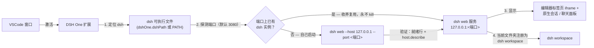

<p align="center">
  
</p>

<h1 align="center">DSH One</h1>

<p align="center"><a href="https://www.npmjs.com/package/@deepseek-ai/dsh">DeepSeek Harness</a>（dsh）与 VSCode 之间的桥接插件：dsh 由你自己安装，DSH One 负责定位并启动它，把 dsh 界面嵌进 VSCode，并把当前文件夹预置为 dsh workspace。VSCode 就是 dsh 的启动器和显示器。</p>

<p align="center">
  <a href="https://github.com/imchangchang/dsh-one/actions/workflows/ci.yml"></a>
  <a href="LICENSE"></a>
  <a href="#兼容性"></a>
  <a href="#兼容性"></a>
</p>

<p align="center">
  <a href="#使用者">使用者</a> ·
  <a href="#开发者">开发者</a> ·
  <a href="README.md">English</a>
</p>

> 非官方社区项目，与 DeepSeek 官方无关。"dsh" 名称归其原项目所有。

---

# 使用者

## 能做什么

- **dsh 界面嵌进 VSCode**：dsh web 以本地服务运行，DSH One 把它显示在编辑器标签页（iframe），并提供原生侧边栏：会话列表 + 聊天面板。
- **启动或复用**：扩展探测配置端口，已有 dsh 实例就直接收养复用（只连接，永不 kill）；否则自己 spawn `dsh web`。不下载、不管理运行时、不做更新检查——升级 dsh 由你自己 `npm update -g`。
- **workspace 同步**：把当前文件夹注册为 dsh workspace（幂等），dsh 打开就落在你正在工作的目录。
- **原生会话列表**：按 workspace 分组（当前文件夹置顶），支持搜索（标题 / 会话 ID）、排序（最近 / 最早 / 按标题）、置顶、标为未读、重命名、归档、分叉、"打开文件夹"等操作；会话行 hover 出「⋯」菜单，列表订阅 dsh host 事件流自动刷新。
- **原生聊天面板**：markdown 渲染、工具调用紧凑行式排版（kimi-cli 风格动作短语、输出折叠可展开）、内联权限确认与提问、plan-review 卡片、todo 清单、子代理运行、运行中一键停止。
- **对话功能**：复制消息、标记有用/没用、从已完成轮次分叉新会话、跳转子代理会话。
- **输入区**：图片附件（缩略图预览）、文件附件（路径 chip）、权限模式选择器、模型选择器、agent preset 选择器、上下文容量条（快用完时提前预警）。
- **把文件发进对话**：编辑器或资源管理器里右键任意文件 → `DSH One: 发送到当前会话`；图片显示缩略图、其他文件显示路径 chip。
- **状态栏**：显示 `DSH: 运行中 :端口 / 启动中 / 已停止 / 错误`，点击聚焦面板。

## 快速开始

前置：先自行安装 dsh（需要 Node ≥ 22）：

```bash
npm install -g @deepseek-ai/dsh@next
```

然后安装 DSH One（发布后可从 VS Code 扩展市场安装，或 `npm run package` 打出 `.vsix` 手动安装），点击活动栏的 DSH One 图标。首次使用会自动定位 dsh 并启动服务（未安装 dsh 时会提示安装）。服务只监听 `127.0.0.1`。

## 工作原理



1. **定位**：`dshOne.dshPath` 配置优先，否则在 PATH 上找 `dsh`；找不到就报错并引导安装。
2. **启动或复用**：探测配置端口（默认 3080）——POST `/api/host.describe` 并校验 `rpcId` 回显，确认是 dsh 就直接**收养复用**（只连接，永不 kill）；否则自己 spawn `dsh web --host 127.0.0.1 --port <端口>`。
3. **显示**：编辑器标签页用 iframe 嵌入完整官方 dsh web 界面（`?dsh_embed=vscode` 是预留嵌入参数，截至 dsh 0.1.1-rc.2 官方未消费）；侧边栏提供原生会话列表与聊天面板，由 dsh 事件流驱动。
4. **workspace 预置**：把当前文件夹注册为 dsh workspace（幂等），dsh 按"最近活跃 workspace"策略直接落在它上面。

## 截图

<!-- TODO: 截图占位 — 请在真实 VSCode 中打开 DSH One 面板，截图后放到 assets/screenshots/（如 chat-panel.png、sessions-sidebar.png），并以相对路径替换本段占位。 -->

> 截图待补——将由维护者在真实 VSCode 窗口中截取，放入 `assets/screenshots/` 后以相对路径引用。

## 使用指南

- **侧边栏（默认）**：点击活动栏的 DSH One 图标打开侧边栏——会话列表 + 原生聊天面板。点选会话即附着并聚焦聊天面板，也可新建会话。
- **编辑器标签页里的 dsh web**：`DSH One: 打开 dsh 页面` 在编辑区标签页打开完整官方 dsh web 界面（iframe）。
- **常用命令**（`Ctrl/Cmd+Shift+P`）：

  | 命令 | 说明 |
  | --- | --- |
  | `DSH One: 打开面板` | 聚焦侧边栏聊天面板 |
  | `DSH One: 打开 dsh 页面` | 在编辑区标签页打开 dsh web |
  | `DSH One: 重启服务` / `DSH One: 停止服务` | 重启 / 停止 dsh 服务 |
  | `DSH One: 显示日志` | 查看扩展日志 |
  | `DSH One: 查看 dsh 安装指南` | 打开官方 dsh 安装页 |

- **发送文件**：编辑器或资源管理器里右键文件 → `DSH One: 发送到当前会话`，把该文件作为附件暂存到当前活跃会话的输入框。
- **状态栏**：显示服务状态，点击聚焦面板。

## 配置项

| 配置 | 类型 | 默认 | 说明 |
| --- | --- | --- | --- |
| `dshOne.dshPath` | `string` | `""` | dsh 可执行文件路径；留空则在 PATH 上查找 `dsh` |
| `dshOne.port` | `number` | `3080` | 服务端口；`0` 表示由 OS 分配（此时跳过收养探测） |
| `dshOne.autoStart` | `boolean` | `true` | 扩展激活时自动启动（或复用）dsh web 服务 |

## 安全与权限

- **进程安全**：插件只会终止自己 spawn 的 dsh 进程；收养的已有实例在任何路径下都不会被 kill。
- **生命周期**：dsh 与 VSCode 窗口解绑——关闭或重载窗口不会杀掉 dsh；只有 `DSH One: 停止服务` / `重启服务` 才会停止它（POSIX 整组 SIGTERM→SIGKILL，Windows `taskkill /T /F`）。意外退出由 30s 健康检查发现（不弹窗）。
- **子进程环境**：剔除 `NODE_OPTIONS` 和 `ELECTRON_RUN_AS_NODE`（扩展宿主注入的这两个变量会让普通 node 子进程异常）。
- **仅本机**：服务只监听 127.0.0.1；webview CSP 只允许来自 127.0.0.1 / localhost 的 frame。
- **不管理运行时**：扩展不下载或管理 Node.js / dsh，也不做更新检查；不读写 `~/.dsh`（那是 dsh 自己的数据，扩展只在自己的存储目录里保留一份日志文件和 pidfile）。

## 兼容性

- **VS Code**：`^1.96.0`（见 package.json 的 `engines`）。
- **dsh**：由你通过 npm 安装（`@deepseek-ai/dsh@next`，Node ≥ 22）。`--no-open` 需要 dsh ≥ 0.1.0-rc.7，旧版不认识该参数会直接退出；截至 dsh 0.1.1-rc.2 官方 UI 未消费 `dsh_embed=vscode`（隐藏侧栏的效果尚不存在）。
- **平台**：Windows / macOS / Linux（纯 TypeScript，零运行时依赖——仅 Node 内置模块 + vscode API）。

### 已知限制

- **Remote（SSH/WSL/容器）未验证**：扩展声明 `extensionKind: ["workspace"]`，理论上跑在远端、webview 的 127.0.0.1 依赖 VSCode 自动端口转发，但未实际测试。
- **多窗口**：每个 VSCode 窗口各自管理服务；端口被占用时靠收养机制共享已有实例，端口为 0 时各窗口各自起实例。dsh UI 的会话恢复依赖 localStorage（按 origin 隔离），`port: 0` 每次换端口会导致恢复失效，建议固定端口。

## 卸载

在 VS Code 扩展视图中卸载本扩展即可。dsh 本体由你自行安装，不受影响；扩展只会停止自己 spawn 的 dsh 进程（收养的实例继续运行），dsh 数据（workspace、会话）原样保留。

---

# 开发者

## 环境要求

- Node ≥ 22.6（`npm test` 用 `node --test` 直接跑 `.ts` 文件，依赖 type stripping）
- VSCode ≥ 1.96（`engines.vscode`）
- 本机已安装可用的 dsh：`npm i -g @deepseek-ai/dsh@next`（扩展不再自动下载运行时，调试和点验都需要真实 dsh）

## 常用命令

| 命令 | 干什么 |
| --- | --- |
| `npm run build` | esbuild 打包：`dist/extension.js`（宿主）+ `dist/chatWebview.js`（聊天前端）；有 warning 会以非零码退出 |
| `npm run typecheck` | `tsc --noEmit` |
| `npm test` | `node --test test/*.test.ts`——只覆盖 `src/pure/` 的单测 |
| `npm run package` | build + `vsce package` 打出 `.vsix` |

## 调试

在 VSCode 里打开本仓库，`npm run build` 后按 F5——会拉起 Extension Development Host 窗口，`src/` 里可下断点（带 sourcemap）。dev host 默认 `dshOne.autoStart` 自动启动 dsh；日志在「输出 → DSH One」面板。注意 dev host 与正式 VSCode 共用 `~/.dsh` 和默认端口——如果 3080 已有 dsh 在跑，dev host 会直接**收养**它而不是另起实例。

## 架构

DSH One 是薄桥接：定位 dsh → 探测/收养/spawn → 嵌入。扩展宿主**零运行时依赖**（仅 Node 内置模块 + vscode API）；聊天 webview 由 esbuild 内联 marked + dompurify 打包（无运行时外部加载）。

```
src/
├── extension.ts        # activate：注册命令、视图、自动启动
├── server/             # locateDsh、ServerManager（生命周期）、spawnDsh（短命启动器）、
│                       #   dshRpc（host RPC）、muxEvents/hostEvents（WS 事件流）
├── ui/                 # webview（iframe 标签页）、chatView（原生面板宿主）、
│                       #   sessionsStore/jobsStore（数据层）、statusbar
├── pure/               # 纯逻辑，禁止 import vscode（node --test 可单测）：
│                       #   envelope、readyLine、semver、hostFrames、sessionTree……
└── test/               # src/pure/ 的单测
```

核心流程：

1. **定位**：`dshOne.dshPath` 配置优先，否则 PATH 上的 `dsh`；用 `dsh --version` 验证。
2. **探测与收养**：POST `/api/host.describe` 并校验 `rpcId` 回显。端口上是真 dsh → **收养，永不 kill**；是别的服务 → 找空闲端口临时顶替（不写回设置）；无应答 → spawn。
3. **spawn**：经短命启动器（`ELECTRON_RUN_AS_NODE`）拉起，dsh 脱离扩展宿主进程树、窗口 reload 后存活；身份写 pidfile，下次激活时 re-own。`--no-open` 仅在 dsh ≥ 0.1.0-rc.7 时追加。
4. **就绪**：每 250ms 轮询 `host.describe`（`port: 0` 时从日志文件解析 `dsh web: http://127.0.0.1:<端口>` 就绪行），之后每 30s 健康检查。
5. **显示**：编辑器标签页显示 iframe `http://127.0.0.1:<端口>/?dsh_embed=vscode`；侧边栏聊天面板是原生 webview，由 dsh 事件流（mux + host）喂数据，经 `src/pure/conversation.ts` 折叠成 `ChatState`。

完整的模块地图、状态模型与设计决策（含出处）见 [docs/architecture.md](docs/architecture.md)。

## 测试约定

- **纯逻辑**：`src/pure/` 禁止 import `vscode`（否则 `node --test` 跑不起来）。修这里的逻辑 bug：先在 `test/` 写一条**失败**测试，修码期间不许碰测试文件，修完让测试转绿——bug 固化进回归。
- **UI**：渲染/布局/交互单测测不到：用浏览器渲染的 webview harness（`ai-visual-validation` skill，截图对照期望描述）核对，再在 dev host 里人工点验。
- **CI**：typecheck + test + build + package + spawn 冒烟，三平台矩阵（`.github/workflows/ci.yml`）。

## 发版

1. 把 `package.json` 的 publisher 改成你在 marketplace 的 ID（占位符发不上去）。
2. 更新 `version` 和 `CHANGELOG.md`。
3. `npm run typecheck && npm test && npm run package`，然后 `npx vsce login <publisher>` / `npx vsce publish`。
4. 发布前按 [docs/development.md](docs/development.md) 的人工点验清单过一遍（未装 dsh 路径、收养不 kill、状态栏四态、各平台 spawn/杀进程）。

## 文档

- [docs/architecture.md](docs/architecture.md) — 模块结构、核心流程、设计决策及出处
- [docs/development.md](docs/development.md) — 环境、构建/调试、发版流程、人工点验清单
- [docs/roadmap.md](docs/roadmap.md) — 原生前端路线图、已知不足与候选方向

## License

MIT © dsh-one contributors
