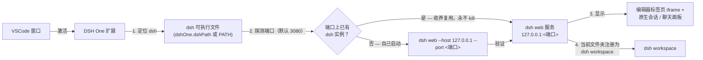

<p align="center">
  
</p>

<h1 align="center">DSH One</h1>

<p align="center"><a href="https://www.npmjs.com/package/@deepseek-ai/dsh">DeepSeek Harness</a>（dsh）与 VSCode 之间的桥接插件：dsh 由你自己安装，DSH One 负责定位并启动它，把 dsh 界面嵌进 VSCode，并把当前文件夹预置为 dsh workspace。VSCode 就是 dsh 的启动器和显示器。</p>

<p align="center">
  <a href="https://github.com/imchangchang/dsh-one/actions/workflows/ci.yml"></a>
  <a href="LICENSE"></a>
  <a href="#兼容性"></a>
  <a href="#兼容性"></a>
</p>

<p align="center">
  <a href="README.md">English</a>
</p>

> 非官方社区项目，与 DeepSeek 官方无关。"dsh" 名称归其原项目所有。

---

## 能做什么

- **dsh 界面嵌进 VSCode**：dsh web 以本地服务运行，DSH One 把它显示在编辑器标签页（iframe），并提供原生侧边栏：会话列表 + 聊天面板。
- **启动或复用**：扩展探测配置端口，已有 dsh 实例就直接收养复用（只连接，永不 kill）；否则自己 spawn `dsh web`。不下载、不管理运行时、不做更新检查——升级 dsh 由你自己 `npm update -g`。
- **workspace 同步**：把当前文件夹注册为 dsh workspace（幂等），dsh 打开就落在你正在工作的目录。
- **原生会话列表**：按 workspace 分组（当前文件夹置顶），支持搜索（标题 / 会话 ID）、排序（最近 / 最早 / 按标题）、置顶、标为未读、重命名、归档、分叉、"打开文件夹"等操作；会话行 hover 出「⋯」菜单，列表订阅 dsh host 事件流自动刷新。
- **原生聊天面板**：markdown 渲染、工具调用紧凑行式排版（动作短语、输出折叠可展开）、内联权限确认与提问、plan-review 卡片、todo 清单、子代理运行、运行中一键停止。
- **对话功能**：复制消息、标记有用/没用、从已完成轮次分叉新会话、跳转子代理会话。
- **输入区**：图片附件（缩略图预览）、文件附件（路径 chip）、权限模式选择器、模型选择器、agent preset 选择器、上下文容量条（快用完时提前预警）。
- **把文件发进对话**：编辑器或资源管理器里右键任意文件 → `DSH One: 发送到当前会话`；图片显示缩略图、其他文件显示路径 chip。
- **状态栏**：显示 `DSH: 运行中 :端口 / 启动中 / 已停止 / 错误`，点击聚焦面板。

## 快速开始

前置：先自行安装 dsh（需要 Node ≥ 22）：

```bash
npm install -g @deepseek-ai/dsh@next
```

然后从 VS Code 扩展市场安装 DSH One，点击活动栏的 DSH One 图标。首次使用会自动定位 dsh 并启动服务（未安装 dsh 时会提示安装）。服务只监听 `127.0.0.1`。

## 工作原理



1. **定位**：`dshOne.dshPath` 配置优先，否则在 PATH 上找 `dsh`。
2. **启动或复用**：先探测配置端口上有没有已经在跑的真 dsh：有就直接**收养复用**（只连接，永不 kill）；没有就自己启动 `dsh web`。
3. **显示**：编辑器标签页内嵌完整官方 dsh web 界面，侧边栏提供原生会话列表与聊天面板，由 dsh 事件流驱动。
4. **workspace 预置**：把当前文件夹注册为 dsh workspace，dsh 直接落在你正在工作的目录。

## 使用指南

- **侧边栏（默认）**：点击活动栏的 DSH One 图标打开侧边栏——会话列表 + 原生聊天面板。点选会话即附着并聚焦聊天面板，也可新建会话。
- **编辑器标签页里的 dsh web**：`DSH One: 打开 dsh 页面` 在编辑区标签页打开完整官方 dsh web 界面（iframe）。
- **常用命令**（`Ctrl/Cmd+Shift+P`）：

  | 命令 | 说明 |
  | --- | --- |
  | `DSH One: 打开面板` | 聚焦侧边栏聊天面板 |
  | `DSH One: 打开 dsh 页面` | 在编辑区标签页打开 dsh web |
  | `DSH One: 重启服务` / `DSH One: 停止服务` | 重启 / 停止 dsh 服务 |
  | `DSH One: 显示日志` | 查看扩展日志 |
  | `DSH One: 查看 dsh 安装指南` | 打开官方 dsh 安装页 |

- **发送文件**：编辑器或资源管理器里右键文件 → `DSH One: 发送到当前会话`，把该文件作为附件暂存到当前活跃会话的输入框。
- **状态栏**：显示服务状态，点击聚焦面板。

## 配置项

| 配置 | 类型 | 默认 | 说明 |
| --- | --- | --- | --- |
| `dshOne.dshPath` | `string` | `""` | dsh 可执行文件路径；留空则在 PATH 上查找 `dsh` |
| `dshOne.port` | `number` | `3080` | 服务端口；`0` 表示由 OS 分配（此时跳过收养探测） |
| `dshOne.autoStart` | `boolean` | `true` | 扩展激活时自动启动（或复用）dsh web 服务 |

## 安全与权限

- **仅本机**：服务只监听 `127.0.0.1`，不会暴露到你的网络。
- **数据归 dsh**：DSH One 不读写 `~/.dsh`，那是 dsh 自己的数据；卸载插件也不会动你的会话和 workspace。
- **不管理运行时**：插件不下载、不管理 Node.js / dsh，也不做更新检查；升级 dsh 由你自己操作。
- **进程安全**：插件只停止自己启动的 dsh 进程，已有实例只会复用、绝不会被杀；关闭或重载 VSCode 窗口也不会停止 dsh。

## 兼容性

- **VS Code**：`^1.96.0`。
- **dsh**：由你通过 npm 安装（`@deepseek-ai/dsh@next`，Node ≥ 22）。
- **平台**：Windows / macOS / Linux。

### 已知限制

- **Remote（SSH/WSL/容器）未验证**：插件支持在远端运行，但尚未实际测试。
- **多窗口**：每个 VSCode 窗口各自管理服务；端口被占用时共享已有实例，端口为 0 时各窗口各自起实例（会话恢复可能失效——建议固定端口）。

## 卸载

在 VS Code 扩展视图中卸载本扩展即可。dsh 本体由你自行安装，不受影响；扩展只会停止自己 spawn 的 dsh 进程（收养的实例继续运行），dsh 数据（workspace、会话）原样保留。

---

## License

MIT © dsh-one contributors
