# 旧侧栏 vs 现装配侧栏：同一份数据、同一宽度下的并排渲染对照

本文件是 issue **#129** 的产出（两阶段里的**第二阶段**：先源码级对照 #128，再实际渲染对比）。
它只出对照结论，**不改任何功能代码**。上游那份源码级对照在
[`legacy-vs-current-sidebar-compare.md`](./legacy-vs-current-sidebar-compare.md)，本文件末尾的
结论会**逐条交叉引用**它的编号（C1-1 … C1-23）。

- **两侧**：旧侧栏 = 已退役、仍在仓库里的那套（`src/ui/sessionsView.ts` +
  `src/ui/sessionsWebview.ts`）；现装配侧栏 = 装配页里跑的那棵树（`@dsh-one/dsh-workspace-tree`，
  `src/ui/assembly/shell/workspaceTree/`）。
- **数据**：两侧吃的是**同一次**只读网关读取（`session/list` + `workspace/follow` 的基线帧，
  当次实测：14 棵工作区、1168 条可显示会话）。两侧「怎么读」本来就不同，所以 harness 不硬塞
  同一棵 DOM，而是把同一批事实各按**它自己的原生通道**喂进去（旧侧栏吃宿主推的
  `SessionsSnapshot`，现装配侧吃假宿主的 `stateRead` 键值与官方客户端的 `localStorage` 视图态）。
- **harness**：`test/legacy-sidebar/`（`npm run verify:legacy-sidebar`，约 3 分钟，跑法与端口
  见那个目录的 README）。截图与台账都重新生成，随时可复跑。
- **主题**：旧侧栏只认 VS Code 主题变量，渲染时贴的是 VS Code 默认深色主题的取值（出处写在
  `test/legacy-sidebar/theme.ts`）；现装配侧用官方 token。**颜色不在本文的结论范围内**，看的是
  几何与形态。
- **官方机制名词一律用英文原词**（`slot` / `shadow` / `seam`），不造词。

## 怎么看这些图

下游那几张是**并排图**：左旧、右现，同一宽度、1:1。完整的一套（9 个状态 × 260/340/500 三档，
含两侧单独的截图）在 `test/legacy-sidebar/out/shots/`（已 gitignore），跑一次就回来；本文引用的
那 11 张另归档在 `docs/legacy-vs-current-sidebar-shots/`。

**一处要提前说明的差别**：旧侧栏的开箱默认是**所有工作区都展开**，现装配侧的开箱默认是
**只展开当前会话所在的那一组**（#128 的 C1-1）。所以「默认态」那张图里两边都摆成**全部展开**
——目的是让同一批行逐项可比；两边**各自开箱**长什么样，另有一张 `default-native`。

---

# A. 九个状态

## A1. 默认态（两边都展开到同一批行）

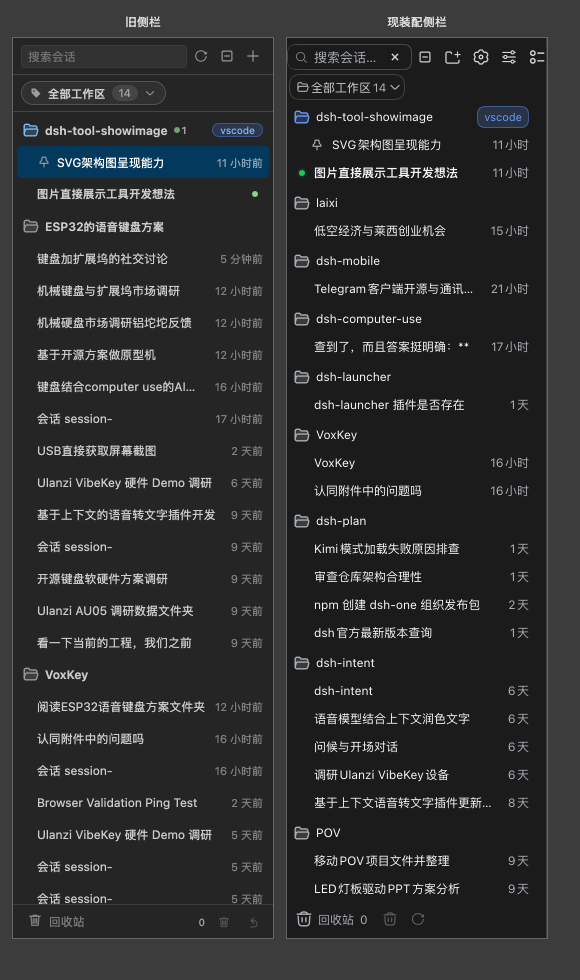
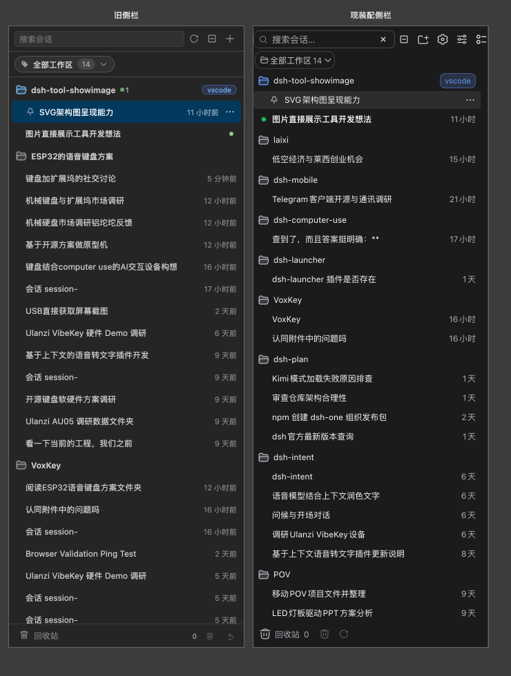
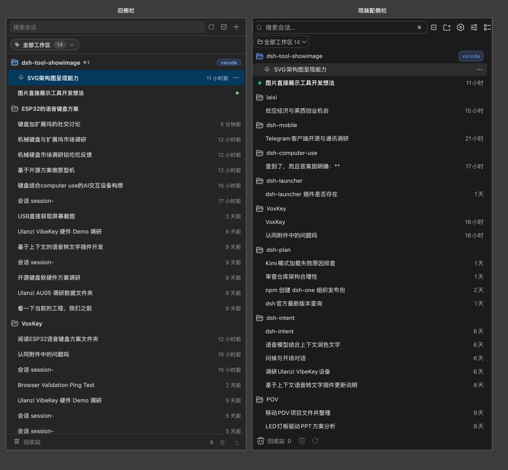

（260 / 340 / 500 三档，横排看宽度变化）

**看到的**：两边的**行结构**是同一门语言（工作区行 = 文件夹图标 + 名字 + 行尾徽标；会话行 =
标题 + 相对时间），但**密度整体差一档**：旧的行 32px、字号 12px；现在的行 26px、标题 12px /
行高 18px（官方紧凑档）。会话行的**状态标记换了位置**：旧的在行尾（和时间互斥），现在的在行首
（官方 `slot`，和时间并存）。工作区行的顺序两边不同（见结论 C-1）。

## A2. 开箱默认（各按各的默认展开态）

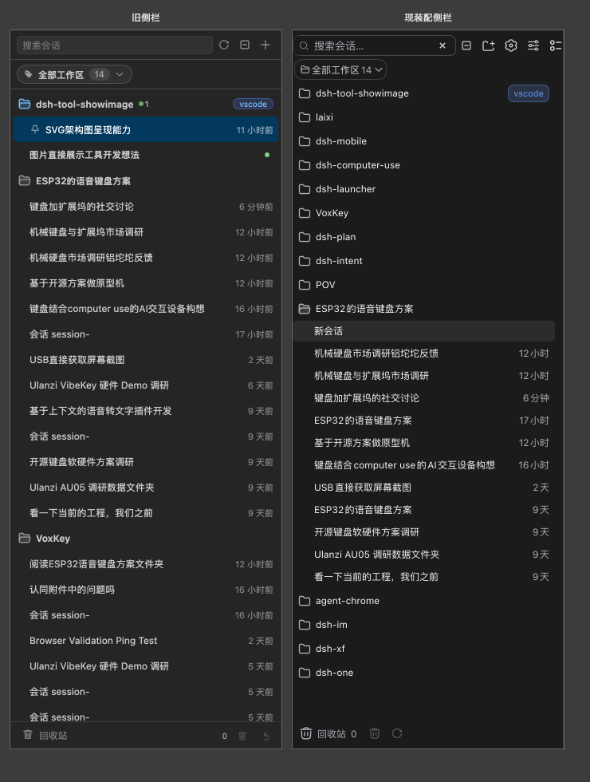

**看到的**：旧侧栏一进来把全部工作区摊开；现装配侧只把当前会话那一组展开，其余是收起的组头。
这是进入侧栏第一眼就会看到的差别（#128 的 C1-1），渲染侧完全对得上。

## A3. 折叠态（所有工作区都收起）

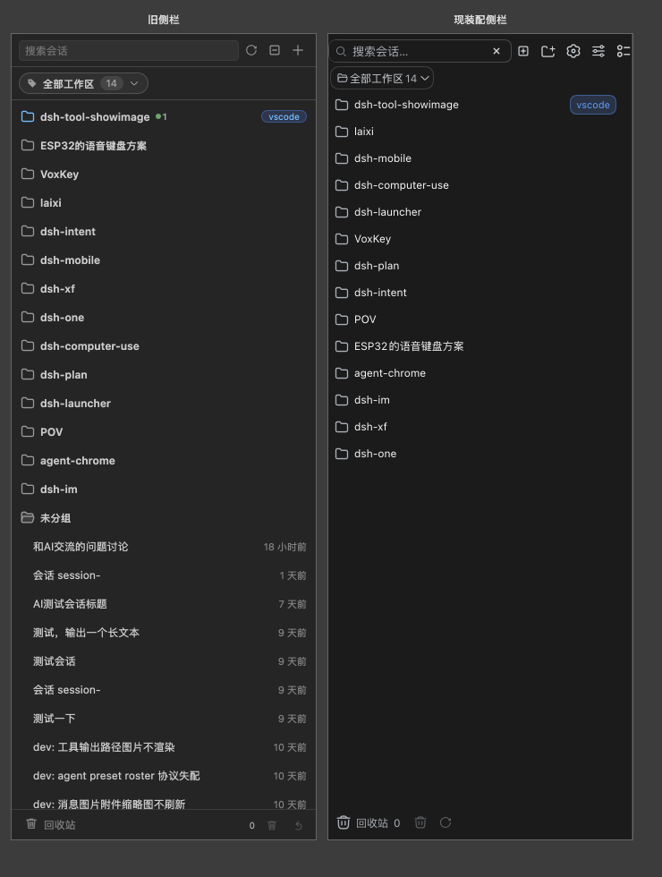

**看到的**：两边都是「一列组头」，行高差一档（32 vs 26）。旧侧栏组头行尾仍带三项状态计数
（待交互 / 运行中 / 未读，收起的组上正是最有用的时候）；现装配侧只有「运行中 / 等待交互」
两项（#128 的 C1-9）。

## A4. 多选态（组头勾选框全选）

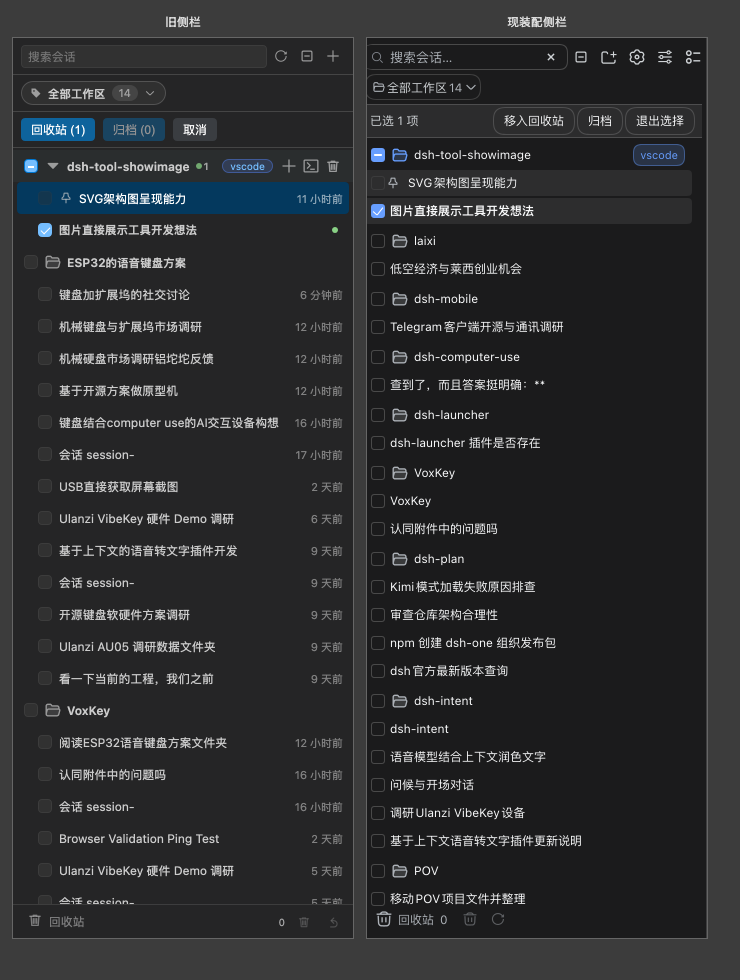

**看到的**：两边都能从组头一次勾满整组，勾选框都在行首。差别在**动作条**：旧的是
「移入回收站 (N) / 归档 (N) / 取消」（计数写在按钮上），现在的是「已选 N 项 / 移入回收站 /
归档 / 退出选择」（计数单列，按钮取官方 `Button` 的 `sm` 档）。分组过滤条两边都**没有**收起
（实测旧 145×24、现 116×26，都在场）。

## A5. 标签组态（两个组各两名成员）

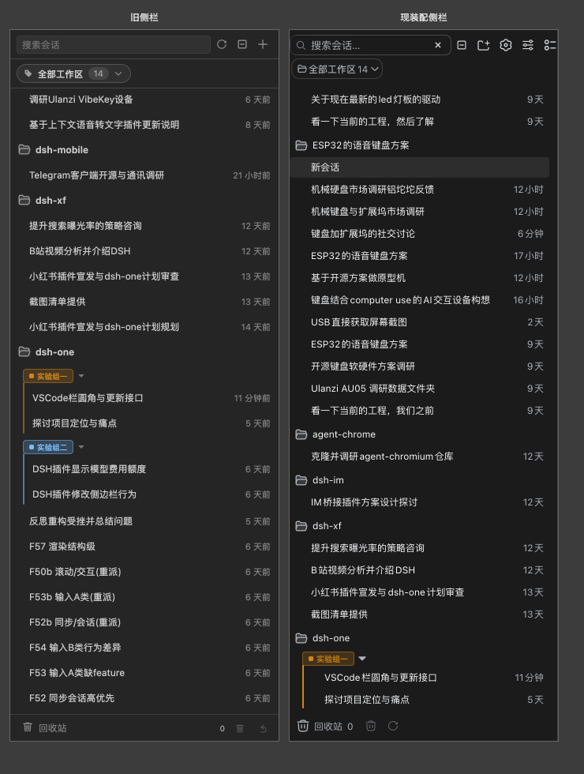

**看到的**：这一组**最像**。pill 的高度 / 圆角 / 字号、组头高度、竖线的左缘与颜色、组内行的
缩进（都 24px）逐项相同——#122 把现装配侧改回旧规格之后，两边基本重合。唯一不同的是竖线的
**长度**（旧 65px、现 55px），而这不是规格差异：竖线从组头下沿贯到组块底部，组内行矮了 6px
一行，两行就短 12px。

## A6. 回收站抽屉展开

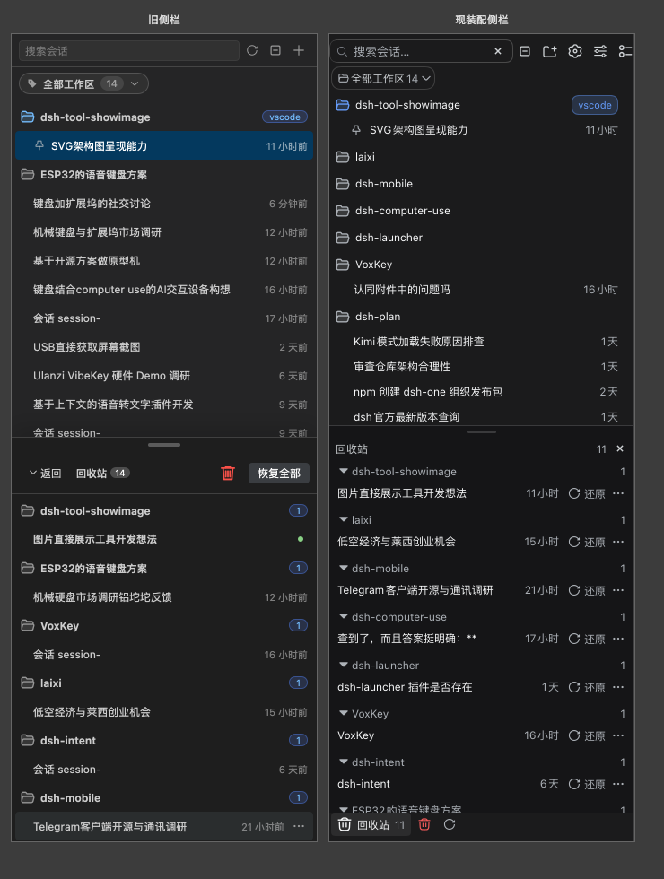

**看到的**：抽屉的半高、提手下拉、按原工作区分块、块内倒序两边一致。差别在**抽屉头**：旧的是
「‹ 返回 + 回收站 + 计数 + 清空 + 恢复全部」（47px 高），现在是「回收站 + 计数 + ✕」（26px 高），
清空与恢复全部只剩底部入口行那两枚（#128 的 C1-10）。块头高 32 → 24、行高 32 → 26。

## A7. 空态（零工作区）

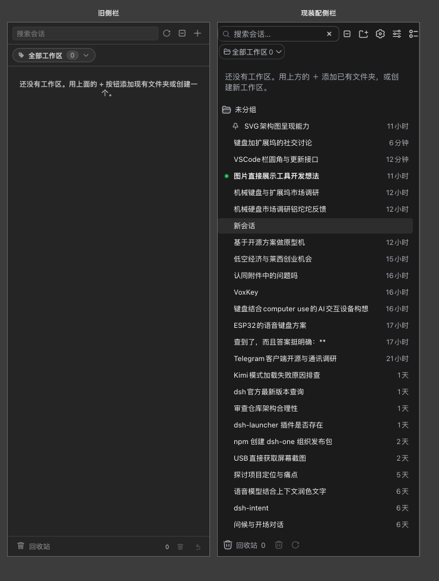

**看到的**：把工作区清单清空、会话还在时，两边出的都是「还没有工作区…用上方的 ＋」提示
**加上一个「未分组」桶**（桶里是同一批会话）。文案与结构一致，空态的内边距差一点
（上 20px → 16px）。这一条 #128 没单列，实测两边一致。

## A8. 右键菜单一级（会话行菜单）

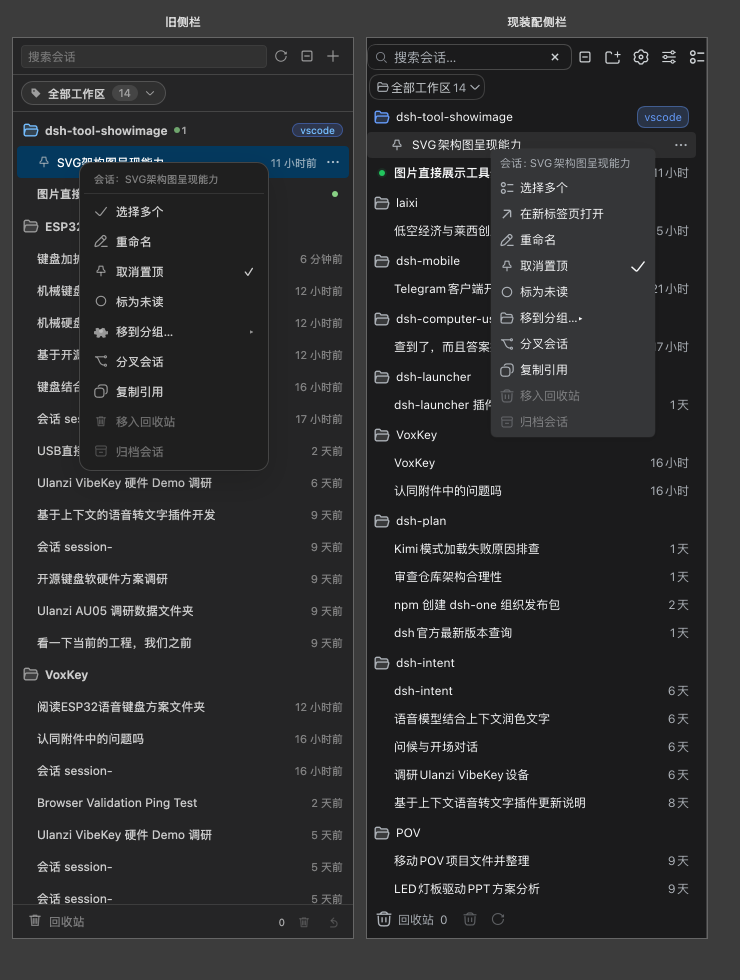

**看到的**：两边的项序与分组基本一致（#128 的 A3.1 逐项核过：旧 10 项 / 现 11 项，多了「在新
标签页打开」）。菜单的**几何整套收紧**：容器宽 190 → 164、圆角 12 → 7、内边距 4 → 2，项高
30 → 26、圆角 8 → 5、左内边距 10 → 7，行高从随字体（`normal`）改成显式的 18px。字号与图标位
（12px / 14×14）两边相同。

## A9. 右键菜单二级（「移到分组…」展开）

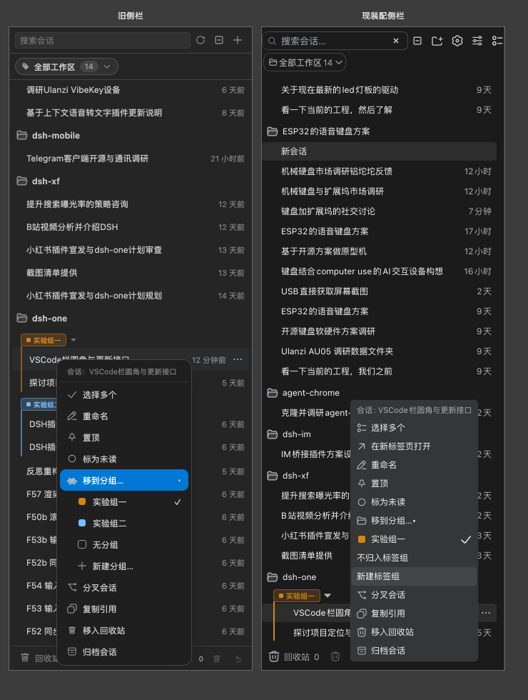

**看到的**：两边都是**就地展开**（不是右侧飞出一层），子项 = 本工作区的标签组 + 「不归入」+
「新建」（#128 的 A3.1 记的形态对得上）。差别是**缩进**：旧侧栏把子项整体右移 16px；现装配侧
不额外缩进——子项直接排在父项的图标列上（量到的 20px 是父项图标 14px + 父项行内间隙 6px，
不是缩进）。

---

# B. 逐项几何对照（63 项）

同一份数据、同一宽度（340px，另两档见台账，**三档读数完全一样**——差出来的都不是布局挤出来
的）。全部读 `getBoundingClientRect` 与 computed style，不看图。表格里的单位除注明外都是 px。
「现」这类读数取的是 harness 里的 **VS Code 密度档**（真侧栏里跑的就是它）。

## B1. 行几何（默认态）

| 项 | 旧实测 | 现实测 | 差 |
| --- | --- | --- | --- |
| 会话行高 | 32 | 26 | 32 → 26 |
| 会话行圆角 | 4px | 5px | +1px |
| 会话行左内边距 | 20px | 7px | -13px |
| 会话行右内边距 | 6px | 7px | +1px |
| 会话行左边距 | 4px | 0px | -4px |
| 会话行间距（相邻两行） | 0 | 2 | 0 → 2 |
| 会话标题字号 | 12px | 12px | 一致 |
| 会话标题行高 | normal | 18px | normal → 18px |
| 工作区行高 | 32 | 26 | 32 → 26 |
| 工作区行圆角 | 0px | 5px | +5px |
| 工作区行左内边距 | 10px | 7px | -3px |
| 工作区名字号 | 12px | 12px | 一致 |
| 组间距（相邻两个工作区块） | 0 | 4 | 0 → 4 |
| 行首图标位（文件夹/箭头） | 16×16 | 16×20 | 16×16 → 16×20 |
| 会话行首图标位（状态槽） | 16×16 | 16×20 | 16×16 → 16×20 |
| 未读状态点尺寸 | 6×6 | 10×10 | 6×6 → 10×10 |
| 置顶图钉尺寸 | 14×14 | 14×14 | 一致 |
| 行尾动作按钮（⋯） | 20×20 | 16×16 | 20×20 → 16×16 |
| 当前工作区小胶囊 | 50.58×14 | 51.64×22 | 高度 +8px |

## B2. 顶部骨架（默认态）

| 项 | 旧实测 | 现实测 | 差 |
| --- | --- | --- | --- |
| 顶栏高度 | 37 | 26 | 37 → 26 |
| 顶栏图标按钮 | 24×24 | 26×26 | 24×24 → 26×26 |
| 搜索框高度 | 23 | 26 | 23 → 26 |
| 搜索框圆角 | 4px | 10px | +6px |
| 分组过滤胶囊高 | 24 | 26 | 24 → 26 |
| 分组过滤胶囊圆角 | 999px | 999px | 一致 |
| 分组过滤胶囊字号 | 12px | 12px | 一致 |
| 列表左内边距 | 0px | 4px | +4px |
| 列表下内边距 | 2px | 7px | +5px |
| 回收站入口行高 | 34 | 26 | 34 → 26 |
| 回收站入口动作按钮 | 26×26 | 26×26 | 一致 |
| 回收站入口行字号 | 12px | 14px | +2px |

（顶栏在旧侧栏里是一条带 1px 下边线的 37px 横条——搜索框 + 刷新 + 折叠全部 + 新建；现装配侧
是官方的分节头，26px、没有分隔线，图标按钮多两枚。旧侧栏那只**手动刷新**按钮现在没有了，
是 #128 的 C1-5。）

## B3. 多选（多选态）

| 项 | 旧实测 | 现实测 | 差 |
| --- | --- | --- | --- |
| 组头勾选框尺寸 | 14×14 | 16×20 | 14×14 → 16×20 |
| 选择态动作条高 | 36 | 28 | 36 → 28 |
| 动作条上内边距 | 6px | 0px | -6px |
| 动作条按钮高 | 23 | 28 | 23 → 28 |

## B4. 标签组（标签组态）

| 项 | 旧实测 | 现实测 | 差 |
| --- | --- | --- | --- |
| 标签组 pill 高 | 18 | 18 | 一致 |
| 标签组 pill 圆角 | 4px | 4px | 一致 |
| 标签组 pill 字号 | 10px | 10px | 一致 |
| 标签组组头高 | 22 | 22 | 一致 |
| 标签组竖线长 | 65 | 55 | 65 → 55（跟着组内行高变，不是规格差异） |
| 标签组竖线左缘（相对组块左缘） | 16 | 16 | 一致 |
| 组内会话行左内边距 | 24px | 24px | 一致 |

## B5. 回收站抽屉（抽屉展开态）

| 项 | 旧实测 | 现实测 | 差 |
| --- | --- | --- | --- |
| 抽屉高（半高档） | 451 | 432 | 451 → 432 |
| 抽屉提手高 | 16 | 12 | 16 → 12 |
| 抽屉把手尺寸 | 36×4 | 32×3 | 36×4 → 32×3 |
| 抽屉头高 | 47 | 26 | 47 → 26 |
| 抽屉分块块头高 | 32 | 24 | 32 → 24 |
| 抽屉里会话行高 | 32 | 26 | 32 → 26 |

（抽屉高差 19px 不是档位差：两边都取「容器的 50%」，但**容器不是同一个**——旧侧栏的抽屉相对整个面板（900px → 450，content-box 再加 1px 边框 = 451），现装配侧的抽屉相对树区容器（864px → 432，border-box）。盒模型也不同：旧 content-box + 1px 边框，现 border-box + .5px 边框。这一项要按「相对谁的一半」读。）

## B6. 空态

| 项 | 旧实测 | 现实测 | 差 |
| --- | --- | --- | --- |
| 空态主文字号 | 13px | 13px | 一致 |
| 空态上内边距 | 20px | 16px | -4px |
| 空态左内边距 | 12px | 12px | 一致 |

## B7. 菜单（菜单一级态）

| 项 | 旧实测 | 现实测 | 差 |
| --- | --- | --- | --- |
| 菜单宽（最小宽撑出来的实际宽） | 190 | 164 | 190 → 164 |
| 菜单圆角 | 12px | 7px | -5px |
| 菜单上内边距 | 4px | 2px | -2px |
| 菜单项高 | 30 | 26 | 30 → 26 |
| 菜单项圆角 | 8px | 5px | -3px |
| 菜单项字号 | 12px | 12px | 一致 |
| 菜单项行高 | normal | 18px | normal → 18px |
| 菜单项左内边距 | 10px | 7px | -3px |
| 菜单项上内边距 | 4px | 3px | -1px |
| 菜单项间隙 | 0 | 0 | 一致 |
| 菜单项图标位 | 14×14 | 14×14 | 一致 |

## B8. 菜单二级（菜单二级态）

| 项 | 旧实测 | 现实测 | 差 |
| --- | --- | --- | --- |
| 二级项相对一级项**图标列**的缩进 | 16 | 20 | 见下方说明 |

说明：这一项量的是「二级项的内容列相对一级项**图标列**挪了多少」。旧侧栏给二级项加 24px 的
`padding-left`（相对一级项的 10px 右移 16px），是**真的往里缩了一层**；现装配侧不额外缩进，
子项直接排在父项的图标列上——量到的 20px 是「父项图标 14px + 父项行内间隙 6px」，不是缩进。
两边都是就地展开，形态一致（#128 的 A3.1）。

## B9. 一致与不同的总数

63 项里 **17 项读数相同**、**46 项不同**、**0 项有一侧量不到**。相同的那些集中在：字号
（会话标题 / 工作区名 / 菜单项 / 分组胶囊 / 空态主文字）、置顶图钉、菜单项图标位与项间隙、
分组过滤胶囊的圆角、标签组那一整组（pill / 组头 / 竖线左缘 / 组内缩进）、回收站入口动作按钮、
空态左内边距。**三档宽度下没有一个几何项会变**——说明这 46 项差的是密度与规格，不是宽度挤出
来的。

---

# C. 结论（按用户能感知的程度排序）

每条都给：现象 → 交叉引用 #128 的编号（**已在源码对照里列出** / **渲染才发现的**）→ 建议。

**C-1. 工作区顺序两侧不同**（渲染才发现的，且与 #128 的判断相反）
- 现象：同一台网关上，旧侧栏排出 `dsh-tool-showimage > ESP32的语音键盘方案 > VoxKey > laixi > …`，
  现装配侧排出 `dsh-tool-showimage > laixi > dsh-mobile > dsh-computer-use > dsh-launcher > …`。
- 出处：旧侧栏把工作区按「当前文件夹优先，其余按**工作区 `updatedAt` 降序**」排
  （`src/pure/sessionTree.ts:417-421`）；现装配侧按网关给的官方顺序排。
- 与 #128 的关系：**#128 的 A1 第一行把「工作区分组顺序」判成「一致（注册顺序 + 未分组收尾）」，
  渲染实测不成立**——两边的第二棵工作区就不是同一个。
- 建议：**请用户拍板**。旧行为「最近动过的工作区靠上」有实际用处；现在的行为与官方 web 一致。

**C-2. 整行的密度矮一档 + 状态点从行尾挪到行首**（已在源码对照里列出：C1-7、C1-2）
- 现象：会话行 / 工作区行 32 → 26px；未读状态点 6×6 → 10×10、位置从行尾（与时间互斥）换到
  行首（与时间并存）。行圆角 4 → 5、工作区行从没有圆角到有 5px。
- 建议：**保持现状**（#113 定的口径：取官方标准档或官方紧凑档，不再有自造中间值），但**位置
  这一条仍待用户拍板**（C1-2 的结论没变）。

**C-3. 顶部骨架整套换档**（部分已在源码对照里列出；「顶栏高度 37 → 26」是渲染补量的）
- 现象：顶栏 37 → 26px（旧的带 1px 分隔线、多一枚手动刷新）；搜索框 23 → 26px、圆角 4 → 10px；
  图标按钮 24 → 26px。
- 与 #128 的关系：图标按钮与搜索框在 B 表里列过；**顶栏高度、抽屉头高度这两项 #128 没有单列**，
  是这次量出来的。
- 建议：**保持现状**。另见 C1-5（手动刷新入口没了），仍待用户拍板。

**C-4. 菜单与抽屉头整套收紧**（菜单部分已在源码对照里列出：C1-7；抽屉头高度是渲染补量的）
- 现象：菜单容器 190 → 164 宽、圆角 12 → 7、内边距 4 → 2；菜单项 30 → 26 高、圆角 8 → 5、
  左内边距 10 → 7；抽屉头 47 → 26 高（少了「‹ 返回 / 清空 / 恢复全部」）；提手 16 → 12、
  把手 36×4 → 32×3。抽屉的**半高**两边取的是**不同容器**的 50%，差 19px（见 B5 的说明）。
- 建议：**保持现状**（同一门密度口径）；抽屉头少的那两枚动作见 C1-10，仍建议补回。

**C-5. 行与行、块与块之间的留白两边不同**（渲染才发现的，且与 #128 的判断相反）
- 现象：旧侧栏**行之间没有间距**（那 2px 是列表容器的上下内边距）、**工作区块之间也没有**
  （4px 只出现在标签组块上）；现装配侧行与行之间 2px、块与块之间 4px。
- 与 #128 的关系：**#128 的 B 表把这两项都判成「一致（同为 2px 量级）」**，实测不成立——
  旧侧栏那 2px 与 4px 都不在「行与行之间 / 块与块之间」这两个位置上。
- 建议：**保持现状**（纵向取官方节奏是 #119 定的口径），但这份对照里「一致」的结论要作废。

**C-6. 行内图标位与动作按钮**（渲染才发现的，且与 #128 的判断相反）
- 现象：旧侧栏的行首图标位是 16×16（文件夹 / 箭头 / 状态标记外框都是），现装配侧统一 16×20
  的官方 `slot`；行尾的 ⋯ 按钮 20×20 → 16×16。
- 与 #128 的关系：**#128 的 A4 与 B 表把「行内图标位」判成「一致（都是官方 16 档图标位）」
  与「不同（按钮变小 4px）」**——前半句不成立：旧侧栏是 16×16、现在 16×20，高度差 4px。
- 建议：**保持现状**（`slot` 的 16×20 是官方规格）；但 4px 的高度差会体现在行的纵向节奏里，
  是 C-2 那一片差异的一部分。

**C-7. 工作区行尾的状态计数少一项**（已在源码对照里列出：C1-9）
- 现象：旧侧栏组头行尾是三项（待交互 / 运行中 / 未读，各带图标与数字），现装配侧是两项
  （运行中 / 等待交互）。折叠态里这个差别最刺眼——组收起时那行计数就是唯一的线索。
- 建议：**建议改**（补上「未读」计数，或明确说不要）。

**C-8. 会话行内与行尾的内容取舍**（已在源码对照里列出：C1-12）
- 现象：同一棵工作区里，旧侧栏先把「运行中 / 有后代在跑 / 未读 / 待交互」的会话提到前面
  （活跃前置），再按最近更新排；现装配侧只有「置顶最前」，其余保持官方顺序或用户选的「最近
  更新」。截图里同一棵工作区内的行序因此不同。
- 建议：**请用户拍板**（旧行为更利于「先看有事要处理的」）。

**C-9. 标签组基本重合，只有竖线长度跟着行高变**（渲染才看出来的「看着像差异、其实不是」）
- 现象：pill 18 高 / 圆角 4 / 字号 10、组头 22、竖线左缘 16、组内缩进 24——逐项相同；唯一
  不同的是竖线长 65 → 55px，而它是「组内两行各矮 6px」算出来的，不是规格差异。
- 建议：**不用动**。这一条的价值是：以后再看到「竖线长短不一样」，先看行高，不要急着改竖线。

**C-10. 多选动作条**（部分已在源码对照里列出：A2 与 C1-7）
- 现象：计数从按钮里挪到单列（「移入回收站 (1)」→「已选 1 项 / 移入回收站」）；动作条 36 → 28
  高、按钮 23 → 28 高；组头勾选框 14×14 → 16×20；两边的分组过滤条在多选态下**都**没有收起。
- 建议：**保持现状**。

**C-11. 标签组二级菜单的缩进没有了**（渲染才发现的）
- 现象：旧侧栏的二级项整体右移 16px（真的缩进一层）；现装配侧不缩进，子项与父项的图标列同列。
  两边的展开方式（就地 accordion）一致。
- 与 #128 的关系：#128 的 A3.1 记了子项内容与展开方式，**没有提缩进这一项**。
- 建议：**请用户拍板**（窄侧栏里不缩进省一行宽度，但层级感弱了）。

**C-12. 空态两边一致**（渲染才核出来的「一致」）
- 现象：把工作区清单清空、会话还在时，两边都出「还没有工作区…用上方的 ＋」+ 一个「未分组」桶，
  桶里是同一批会话；只有内边距差 4px。
- 建议：**不用动**。

## C2. 与 #128 的 23 条剩余差异清单逐条对账

**渲染能看到、并且这次对上了的**（6 条）：C1-1（开箱展开态）、C1-2（状态点位置与大小）、
C1-7（密度收紧）、C1-9（工作区行尾少未读计数）、C1-10（回收站抽屉头与行）、C1-12（少了活跃
前置）。

**渲染看不到的**（10 条，都是交互 / 时机 / 宿主行为，不在这条 harness 的覆盖里）：C1-3（搜索
高亮）、C1-4（搜索时的列表形态）、C1-5（手动刷新入口）、C1-6（未安装 / 服务未启动的空态位置）、
C1-8（重命名弹窗形态）、C1-11（标签组 pill 菜单的打开方式）、C1-13（空工作区能否展开——当天
数据里没有空工作区）、C1-14（工作区分组拖拽排序）、C1-15（给工作区打标的入口位置）、
C1-17（拖拽源行半透明——这次没做拖拽）。这些要靠点开菜单、敲搜索、造失败态或造空工作区才看
得到；本 harness 只渲染，动作一律不实现。

**渲染看不到、也验不到的**（7 条，属于数据 / 机制层）：C1-16（内置标签组）、C1-18（二级菜单
展开方式的差异——这次实测两边都是就地展开，没有差异可看）、C1-19（分叉禁用判据）、C1-20（当前
工作区判据换了；两侧判据的**输入**在 harness 里是一致的，规则差异要读代码）、C1-21（悬停卡在
VS Code 侧栏里不出现）、C1-22（搜索去抖）、C1-23（回收站行菜单标题行）。

**渲染推翻了 #128 的判断的**（4 条，都是这次的新发现）：
- A1「工作区分组顺序一致」→ 实际两侧排法不同（本文 C-1）；
- B 表「行间距一致」→ 实际旧 0 / 现 2（本文 C-5）；
- B 表「组间距一致」→ 实际旧 0 / 现 4（本文 C-5）；
- A4 与 B 表「行内图标位一致」→ 实际旧 16×16 / 现 16×20（本文 C-6）。

**#128 没列、这次量出来的**（5 条）：顶栏高度 37 → 26、抽屉头高 47 → 26、抽屉分块块头 32 → 24、
回收站入口行字号 12 → 14、二级菜单缩进（旧 16 / 现无额外缩进）。

6 + 10 + 7 = 23，与 #128 的清单条数对得上。

---

# D. 纪律与已知取舍

- **网关只读**：全程不喂 prompt、不新建会话、不改任何状态；harness 自己起一个隔离的
  `dsh web`，跑完立刻收掉，不写 `~/.dsh/dsh-owned.json`。旧侧栏的动作消息一律不实现（点了不报错）；
  现装配侧的动作只落在假宿主里。跑前跑后各数一次会话条数（同装配实验室 R-06 的守卫）——
  **它可能因为同一台机器上别的 session 在这几分钟里建了会话而红**（#116 记的读数漂移），
  这次就红过一次（1198 → 1199）。
- **旧侧栏代码只读**：`src/` 一行没改；harness 全在 `test/legacy-sidebar/`，截图归档在
  `docs/legacy-vs-current-sidebar-shots/`。
- **没起真 VS Code 窗口**：全程普通浏览器（Playwright chromium）。这一层验不到的宿主行为
  （CSP 实际执行、原生菜单、主题跟随）由 `scripts/dev-ui-test.sh` 那一档负责。
- **数据是当天的**：会话内容随网关变化，几何读数（本文的 63 项）不随数据变——三档宽度、多次
  重跑都一致；但**行数与行序**会随当天的会话变（例如这次运行期间别处新建了一条会话）。
- **一处为了让两边可比而做的取舍**：旧侧栏的「当前工作区」判据在真运行里吃
  `vscode.workspace.workspaceFolders[0]` 的路径（与现装配侧假宿主上报的是同一份），harness 两边
  给的是同一个值——判据**输入**一致，判据**规则**是否相同是源码问题（#128 的 A1 / C1-20）。
