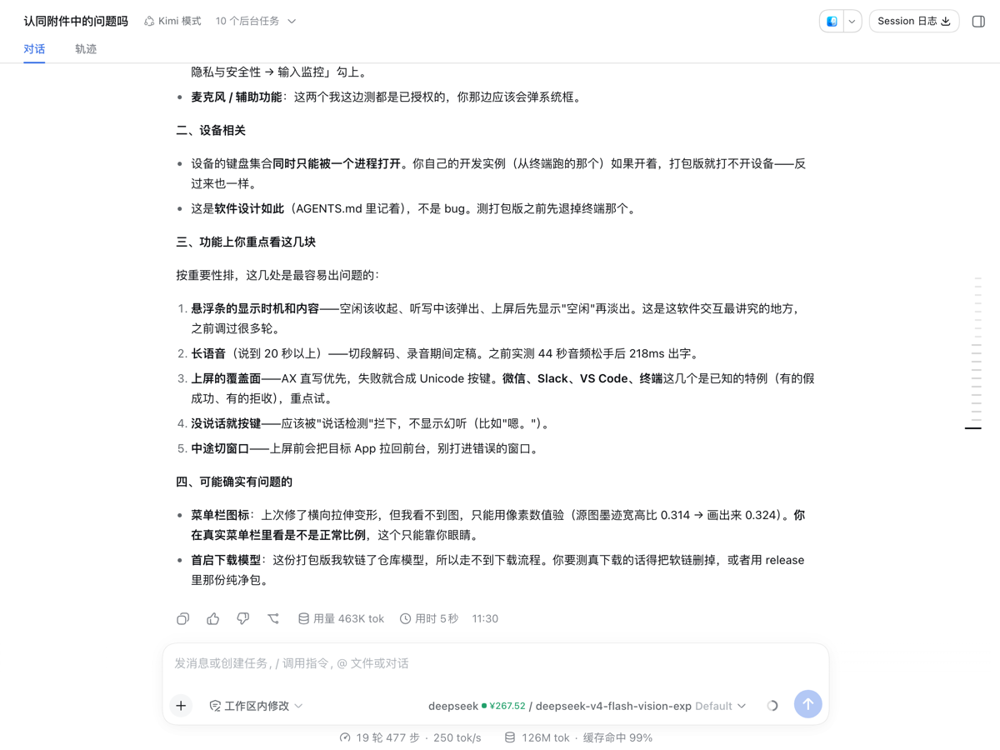
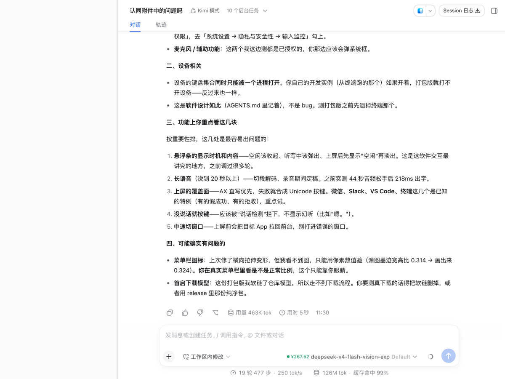
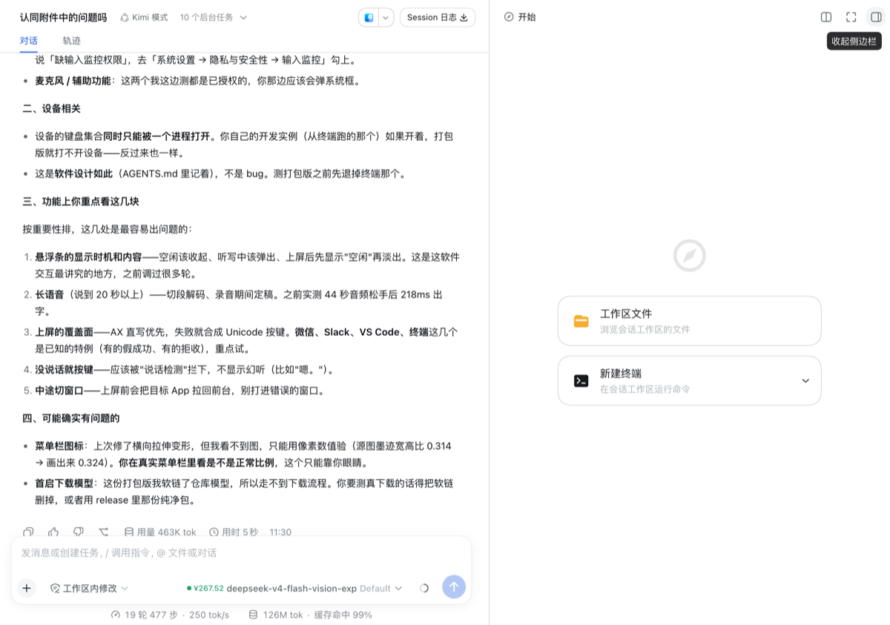
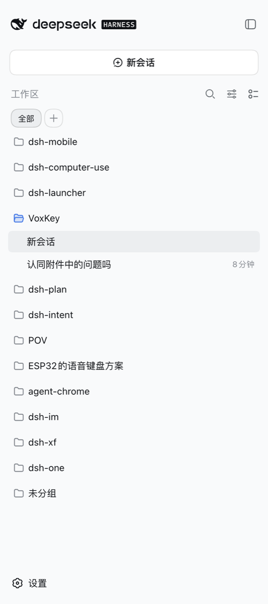
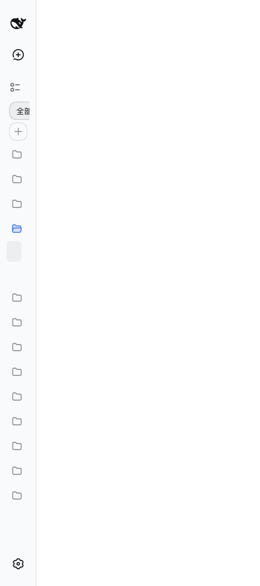
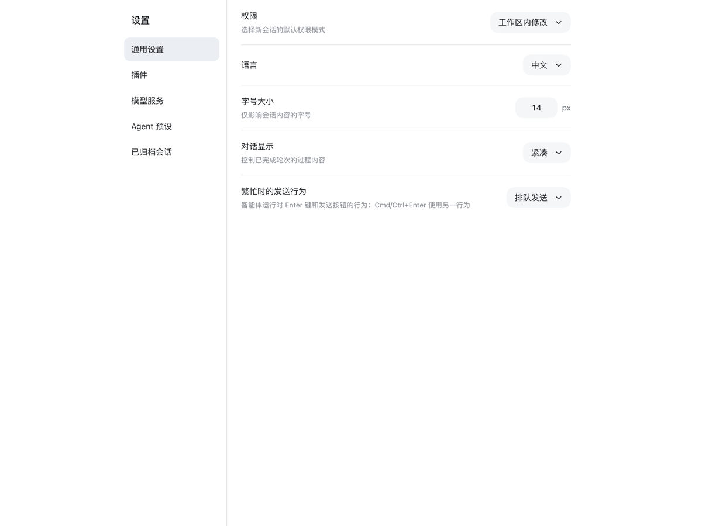
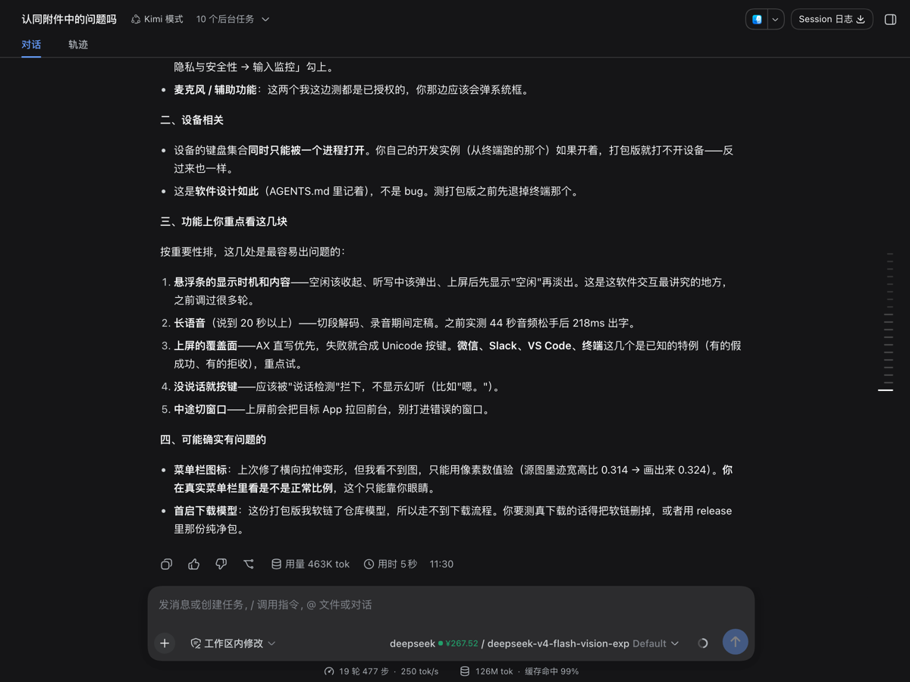

# 原型评估：官方 AppFrame 渲染 root + 只做 VS Code 形态适配（#89）

> **写作时间与适用版本**：2026-09-16 前后的那一轮评估（#89），针对当时三条生产树（chat / sidebar / settings）各自去掉「block 官方 ui-layout」这一条后搭起来的原型树，下面的读数都是那一刻的实测。**结论至今仍然有效**：生产三棵树继续由自有外框插件渲染 root、继续 block 官方 `@deepseek-ai/dsh-client-ui-layout`（判据在 `src/ui/assembly/wireFilter.ts` 的 `UI_LAYOUT` 条目与其注释；#77 试过铁律的首选路径「加载官方件 + 只遮蔽它的 root slot」，三条硬约束使其不可行，证据在 `src/ui/assembly/shell/frameShared.ts` 的文件头）。要看当前事实请读那几处代码与 `docs/architecture.md`；本文只回答「为什么不走官方 AppFrame 渲染 root」这个问题。

决策记录。原型与跑测代码曾在 `test/assembly-lab/prototypes/officialFrame/`（**不改任何生产文件、
不进任何生产装配树**），该目录已随 #189 删除——它回答的问题已有结论（见下文），原型里那两处
脆弱写法（`:has()` 结构规则、把 bootstrap 批当第一批的 `batches[0]`）也不再是正式实现的做法，
留着只会继续示范废弃写法。要回看代码请查 git 历史（删除前的最后一个提交）。
实机数据出处：`test/assembly-lab/out/proto/`（`official-frame.ledger.json` 台账、
`official-frame.report.html` 单文件报告、`shots/*.png`）当时是 gitignored 的一次性产物、现已不在，
截图副本保留在 `docs/official-frame-shots/`。环境：本机真实 dsh 网关 0.1.6-alpha.1（只读）、
Playwright chromium、假宿主。

## 一句话结论

**建议维持现状（自有外框插件渲染 root + block 官方 `@deepseek-ai/dsh-client-ui-layout`）**，
只吸收原型里唯一一处净收益：**settings 树把设置页从自造槽位 `dshOne.settings.page` 换成官方
keyed `main` 全局面板**（`ctx.layout.selectPanel` + `renderSlot('main', {}, {entryKey})`，
零 CSS、纯官方机制）。这一处**已落地（#95）**。

理由是：官方 AppFrame 的列几何是**产品决定**（侧栏列最小 56px 轨道、关不掉；侧栏宽钳在
264–420；中列底线 400），而 VS Code 三种容器的形态是另一套语言（对话面板零侧栏、侧栏视图
单列铺满、设置页整页）。三棵树的形态适配实测下来要压 **1 条 JS 内联样式改写 + 4 条 CSS**
（清单见下），且其中「零侧栏列」这件事**纯 CSS 做不到**；换来的官方白送能力（右栏轨道/把手/
窄容器降级）在现状里已经由 #77 的官方右栏槽位拿到，增量收益很小。另外原型上还实测到一处
官方 AppFrame 路线特有的可见缺陷（收尾主题变浅，见「与现状的对照」），机制尚未定位。

## 一、官方 AppFrame 的结构与几何（读官方源码 + 实测）

结构（`dsh-client-ui-layout/lib/client.js` 的 `AppFrame`，DOM 实测一致）：

```
<div class="<hash>_frame" style="grid-template-columns: <侧栏>px minmax(0,1fr) <右栏>px">
  <div class="<hash>_sidebarCol">…</div>          ← 轨 1：官方侧栏壳（ui-sidebar 的 SidebarRoot）
  <div class="<hash>_centerCol">…</div>           ← 轨 2：keyed `main`（会话面板 / 全局面板）
  <div class="<hash>_rightbarCol">…</div>         ← 轨 3：右栏（面板自己绝对定位贴右缘）
  <div class="<hash>_overlayLayer" data-shell-overlay>…</div>   ← 绝对定位，不占轨
  <div class="<hash>_handle" data-side="sidebar|rightbar">…</div> ← 绝对定位拖拽把手
</div>
```

要点（都决定了形态适配能用什么手段）：

- 整条 `grid-template-columns` 是**内联样式**，且侧栏轨、右栏轨都是**运行时值**（`computeColumns()`
  的解算结果）；列装饰（侧栏底色、0.5px 右边缘）在 **css-module 哈希类名**上。
- **侧栏列关不掉**：官方 `computeColumns()` 里 `sidebar === 0` 表示「收起态 = 56px 轨道」
  （官方注释：24px 图标列 + 两侧 16px 内边距），最小就是这条轨。官方 GUI 自己在窄视口
  （< 1024px）也走这一档，实测：1200px 宽时侧栏轨 280px，400px 宽时 56px。
- `main` 是 **keyed 槽位**；`ctx.layout.selectPanel(id)` 是官方「选中一个全局面板」的公开口，
  选中后右栏自动下线（官方 `RightbarRoot` 在 `activePanelId !== null` 时返回 null）。
- 官方白送的几何：右栏轨道与拖拽把手、中列底线 400px、右栏首开 45% 视口宽并 clamp(300, 70%)、
  窄容器降级、`DocumentTitle`、`panelInfo` 钩子、`ThemePresenter`。

## 二、三态实测（截图在 `docs/official-frame-shots/`）

三棵原型树 = **生产三棵树各自去掉「block 官方 ui-layout」这一条**，其余 block list 与追加插件
逐字不变。所以下面的差异可以直接归因到「谁渲染 root」。

### chat 树：零侧栏列

| 档 | 做法 | 实测 |
| --- | --- | --- |
| `shape=js` | 内联轨道改写（去第一轨、保留第三轨的运行时值）+ 1 条 CSS 压侧栏列装饰 | 1200px：官方写 `280px minmax(0,1fr) 0px` → 改成 `0px minmax(0,1fr) 0px`，侧栏列 0 / 中列 1200 / 右栏 0；**每次官方重渲染只改写 1 次**（不是每帧争用）。500px：官方写 `56px …` → 同样归零，中列 500 |
| `shape=css0` | 纯 CSS：`grid-template-columns:0px minmax(0,1fr) 0px!important` | 侧栏列 0 成立；但右栏轨被写成常量 0 —— 打开右栏时面板照常出现（577px），**中列不让轨**（1280 宽下中列仍是 1280，面板浮在内容上方），官方「让轨」语义丢失 |
| `shape=raw` | 不做适配 | 1200px：侧栏列 280 + 中列 920；500px：侧栏列 56（官方窄容器降级）+ 中列 444 |




**官方右栏是白送的（实测真能用）**：1280px 宽下点会话头右侧角的官方展开钮，面板宽 577、
贴右缘、中列从 1280 让到 704（轨道 576），`rightbar` 拖拽把手在；向左拖 120px 后面板宽 601
（偏好 576→696，被官方解算夹在 `视口 − 侧栏偏好 280 − 中列底线 400 = 600`）。



### sidebar 树：单列铺满

| 档 | 做法 | 实测 |
| --- | --- | --- |
| `shape=fill` | 2 条 CSS（轨写成 `minmax(0,1fr) 0 0`、侧栏根内联 `width` 覆盖成 100%）+ 1 条 CSS 去边线 + **1 次官方 API 调用**（`ctx.layout.toggleSidebar()`） | 400px：侧栏列 400、侧栏根 400（官方下发的内联 `width:280px` 被压掉）、中列与右栏 0、自有工作区树照常渲染；1200px 同形 |
| `shape=raw` | 不做适配 | 400px：侧栏轨 56 + 侧栏根 `hHd-Xa_collapsed`（无内联 width），`sidebar.workspaces` 槽位照渲染但拿到 `wide:false`，**自有工作区树被压成 35px 宽的碎条**；1200px：侧栏列 280（不铺满） |




`?shape=fill` 里那次官方 API 调用不是可选项：VS Code 侧栏视图宽度永远 < 1024px，落进官方
「窄容器自动收起」语义，不打开展开态的话铺满的是那条 56px 图标列。

### settings 树：设置页当 keyed `main`

`shape=page`：往官方 `main` 注册一条 `key='dshOne.settings'` 的 keyed 条目（用官方
`slots.inject('main', …)` 等官方把 `main` 声明出来再注册）并用 `ctx.layout.selectPanel(key)`
选中它 —— 设置页整页渲染在官方中列里，侧栏列 0、中列 1200、右栏自动下线、零崩溃；
**内容侧一行 CSS 都不需要**（官方 `DocumentTitle`、`panelInfo` 白送）。
`shape=raw`：同一套机制不变，但官方侧栏列占 280、设置页只能在 920 里居中。



## 三、CSS 覆盖逐条清单（压的是什么、稳不稳）

| # | 归属 | 选择器 / 手段 | 压的是什么 | 是否 `!important` | 稳定性 |
| --- | --- | --- | --- | --- | --- |
| 1 | chat / settings | JS 改写 frame 的内联 `grid-template-columns`（只把第一轨归零，保留第二、三轨） | 内联样式 | 不适用（直接改内联属性） | 依赖「官方只写这一条内联属性、轨道顺序是 侧栏/中/右」。官方换列顺序或改成 CSS 变量即失效；与 React 争写，实测每次重渲染改写 1 次 |
| 1′ | chat（纯 CSS 档） | `div:has(> [data-shell-overlay]){grid-template-columns:0px minmax(0,1fr) 0px!important}` | 内联样式 | 是 | 同上，且右栏轨被写成常量（右栏不再让轨） |
| 2 | chat / settings | `div:has(> [data-shell-overlay]) > [class*="_sidebarCol"]{border-right:0!important;background:transparent!important}` | css-module 哈希类名上的装饰 | 是 | 按类名后缀匹配（`_sidebarCol`），官方改类名后缀即失效 |
| 3 | sidebar | `div:has(> [data-shell-overlay]){grid-template-columns:minmax(0,1fr) 0px 0px!important}` | 内联样式 | 是 | 同 #1′ |
| 4 | sidebar | `… > [class*="_sidebarCol"]{border-right:0!important}` | 哈希类名装饰 | 是 | 同 #2 |
| 5 | sidebar | `… > [class*="_sidebarCol"] > [data-slot="sidebar"] > [class*="_root"]{width:100%!important}` | 官方下发给侧栏根的**内联 `width`**（264–420 钳位值） | 是 | 两跳：官方 slot 锚点属性 + 侧栏根类名后缀；实测侧栏根不是侧栏列的直接子元素（中间隔着 `div[data-slot="sidebar"]`），写 `> *` 会压不到 |

也就是说：**三棵树要不改内联样式就得改内联样式** —— 「零侧栏列 / 单列铺满」都不是 CSS 能
干净表达的东西，最终逃不掉「JS 改写官方内联属性」或「整条轨道硬写常量」二选一。

定位官方 frame 元素用的锚点是官方语义属性 `[data-shell-overlay]`（AppFrame 给 overlay 层打的
标记）+ `:has()`，没有写死 css-module 哈希前缀；列元素按类名后缀匹配（实验室既有约定）。

## 四、与现状的对照

形态上，两边的差异只有「多出来的部分」：

| | 现状（自有 frame） | 原型（官方 AppFrame） |
| --- | --- | --- |
| chat 树 | 中列 + 自有右列（#77 已声明官方 `rightbar` 槽位并渲染官方右栏） | 中列 + 官方右栏列（几何同官方 GUI；拖拽把手由官方给） |
| chat 树侧栏 | 不存在（block 官方 ui-sidebar） | 存在但宽 0（要 JS 改写内联轨或纯 CSS 覆盖；纯 CSS 档右栏不再让轨） |
| sidebar 树 | 侧栏铺满视图（自有 frame 直接给） | 2 条 CSS + 1 次官方 API 才铺满；不打理时官方自动降级成 56px 图标列、自有树被压成碎条 |
| settings 树 | 自有槽位 `dshOne.settings.page` 渲染整页（自造槽位名；**#95 已改成官方 keyed `main`**） | 官方 keyed `main` 渲染整页（官方机制，零 CSS）← **净收益** |
| 主题呈现 | 我们的 `ThemePresenter` 收尾深色 | 官方 `ThemePresenter`，实测收尾**浅色**（见下） |



**A/B 实验（同一棵 chat 树，只差谁渲染 root）**：控制组（自有 frame + 同一份 block list +
同一批插件）收尾主题深色；原型（官方 AppFrame）收尾主题浅色。两边页面预设相同
（`__DSH_ONE_HOST_THEME__=dark`），**主题服务收到的 `theme/change` 事件序列逐条相同**
（含 payload 与最终服务状态 `vscode-dark`），差异只出在「最后谁把快照写进 DOM」：原型上
官方 `ThemePresenter` 的 apply 与我们的 theme-follow 修正不同步（探针实测：payload 为
`vscode-dark` 的那一次事件之后 DOM 仍是浅色）。这条**只观测到现象、机制未定位**，是官方
AppFrame 路线的已知缺陷（要修得先搞清 cordis 事件投递顺序，或由我们的插件在官方 presenter
之后补一次 apply）。

## 五、风险清单：官方改 AppFrame 结构时，这些覆盖散在哪几处

本节列的是**原型那几条覆盖**的落点与失效方式（原型代码已随 #189 删除，这里只留清单作为
「这条路线的代价」的存档）；生产代码里没有这些覆盖。

1. **`plugins/chatShape.ts`**：内联轨道改写的假设（三轨、顺序 侧栏/中/右、侧栏轨是运行时偏好值）。
   官方改成 CSS 变量或调整列顺序 → 改写函数静默不生效（页面变成「侧栏列还在」）。
2. **`plugins/chatShape.ts` / `plugins/settingsShape.ts` / `plugins/sidebarShape.ts` 的 CSS**：
   4 条规则分别压在 `_sidebarCol`（哈希类名后缀）、官方内联 `grid-template-columns`（侧栏树）、
   侧栏根的内联 `width` 与 `div[data-slot="sidebar"]` 的中转结构（侧栏树）。官方改类名、改内联
   写法、改「侧栏根是锚点的直接子元素」这条结构 → 对应的那一条静默失效（表现为某一列宽不对，
   不会报错）。
3. **`plugins/sidebarShape.ts` 的官方 API 调用**：依赖「窄容器下官方进收起态、`toggleSidebar()`
   打开展开态」这一语义；官方改窄容器断点（`SIDEBAR_AUTO_COLLAPSE = 1024`）或改收起语义 → 铺满
   变成铺 56px 图标列，同样是静默的。
4. **`plugins/settingsShape.ts` 的 keyed `main` 注册**：依赖官方 `main` 是 keyed、`selectPanel`
   语义与 `RightbarRoot` 在全局面板下返回 null。这几项是官方契约（上游探针能覆盖），风险低于
   上面三条 CSS/内联改写。
5. **主题**：官方 `ThemePresenter` 在场时收尾主题与我们的 theme-follow 打架（已实测，机制未定位）。

共同点：**前三条失效都是静默的**（不抛错、不崩，只是长得不对），要靠「浏览器验证 + 人看截图」
发现；这跟现状的失效方式不同——现状下官方改 root 契约会先在 `npm run verify:lab` 的 CONTRACT
套件里炸出来。

## 六、没做到的、只是推断的

- **没做到**：原型只做了形态，没做功能对等。settings 页去掉了「打开配置文件」自有行动与
  `settings.action` 那一段（形态无关，未搬）；三棵树的宿主能力（`hostCall`）、导出、右键菜单等
  插件**照原样加载**（它们挂在官方语义容器上，原型下照常工作），但没有做逐项交互验收。
- **没实测**：真 VS Code webview 宿主层（CSP / 剪贴板 / 原生菜单 / 多 webview 生命周期）——
  按 AGENTS.md 的约定，agent 只跑浏览器验证、不自己起 VS Code 窗口，所以这一层没做；窄到 300px 以下、宽到 2000px 以上的档位；
  官方右栏在 chat 树里与自有插件（git 卡片、清空件）同时活跃时的交互；鼠标拖动把手时的
  指针捕获在真实 webview 里的表现（浏览器里实测可用）。
- **只是推断**：主题差异的机制（推测是 cordis 事件投递与官方 presenter 的 apply 时序不同步）；
  「官方改 AppFrame 结构 → CSS 覆盖失效」的具体表现（按选择器落点推断，未真触发）；
  `?shape=js` 内联改写与 React 的长期共存（只在一轮跑测里观测到「每次重渲染改写 1 次」）。

## 七、建议

1. **维持现状**：三棵树继续由自有外框插件渲染 root，继续 block 官方 `ui-layout`。依据是
   AGENTS.md「优先与官方插件共存、不顶替其角色」那条铁律里的例外——只有官方件与目标形态
   **不可调和**时才允许 block，而本文就是当时那次复评的证据（官方 `ui-layout` 的列几何是产品
   决定，与 VS Code 三种容器的形态不可调和）。
2. **吸收一处净收益**（**已落地：见 #95**）：settings 树把设置页从自造槽位
   `dshOne.settings.page` 换成官方 keyed `main` —— chat 树 root 已经声明
   `main: { kind: 'keyed' }`，settings 树照做即可；配套把 `LayoutController.selectPanel` 从
   「只接受 null」改成官方语义（在槽注册表里查 key）。这样设置页用的是官方契约，`DocumentTitle`、
   `panelInfo`、全局面板语义都白拿，也让「自造槽位名」少一个。
   实际落地的样子：设置页是 `main` 上 key = `dshOne.settings` 的 keyed 条目，注册点用官方
   `slots.inject('main', …)`（等声明出来再注册），渲染按官方 `entryKey` 取键，选中走
   `ctx.layout.selectPanel('dshOne.settings')`；`selectPanel` 的判据照官方查 keyed `main` 的
   实时注册表。页面外观与交互零变化，本文件其余结论（维持自有 frame）不受影响。
3. **不要为了「符合铁律首选路径」换 root 渲染者**：换来的是官方列几何与一波压在官方内联样式/
   哈希类名上的覆盖（第 3 节清单），代价高于收益，且失效方式从「验证集先炸」退化成「静默长歪」。
4. 若将来官方给 AppFrame 加了**关掉侧栏列的官方手段**（例如 `computeColumns` 允许 `sidebar` 为
   `null`/`0` 表示无该列、或加一个 `sidebarHidden` 语义），这条路线的前提就变了，值得重评一次
   —— 那时 chat/settings 两棵树可能只需 1–2 条 CSS。
