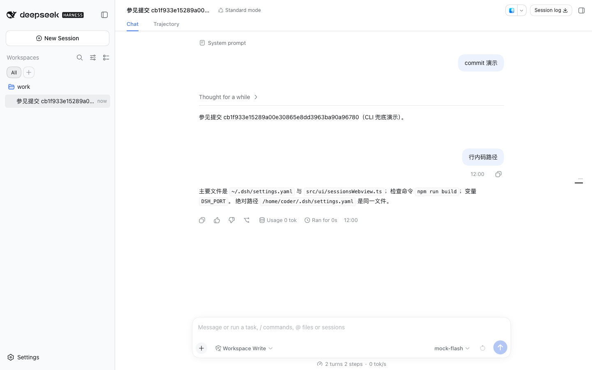

# 自有插件包：monorepo 结构、双端分发与官方 profile 安装（#73）

这篇文档回答三个问题：自有插件怎么打成**官方格式的 npm 包**、同一个包怎么在
VS Code 装配与官方 dsh web 两端都跑起来、以及怎么**实测**它真的在官方那边工作。

## 目标与结论（先看这一段）

- dsh-one 里**能移植的插件**（`@dsh-one/dsh-*`）现在同时是**可安装的官方插件包**：
  包住 `packages/<名>/`，`pnpm add file:packages/<名>` 或发布后的 `npm i` 能把它们
  装进任意 dsh 实例的 profile。
- **一次安装双端生效**：包进 profile 后，官方 web 直接加载它；VS Code 侧装配清单本就从
  同一个网关取（过滤 block list 后叠加自有插件），所以网关那边有的插件，VS Code 侧
  也自然出现。
- 真机实测已经跑通（2026-09-16，0.1.6-alpha.1）：5 个自有插件包装进隔离 profile 后，
  官方 web 页面上全部加载并工作，零 pageerror、零 console error。跑法与逐条证据见
  `scripts/verify-plugins-official.mjs`（`npm run verify:plugins-official`）。



上图是实测现场（**官方页面本身**，不是我们的装配页）：左侧栏是自有的工作区树（分组过滤
胶囊、搜索、工作区行与会话行都是自定义组件），会话头右侧是自有的「Session log」按钮
（官方同名图标条目已被 shadow，不在 DOM 里），对话区两轮来自仓库自带假模型的真回合。

## 官方是怎么找到并加载一个插件包的

这条链路每一环都是官方的机制，我们的包只要满足它的前置条件即可（不要自己发明通路）：

1. **`dsh plugin --profile <name> add <包>`** 把包转发给 profile 目录里的 pnpm。装完
   之后官方会**按装到的状态**重算层列表：装到的包只要在清单里声明了 `dsh.bundle.patch`，
   它的名字就被追加进 `~/.dsh/profiles/<name>/package.json` 的 `dsh.profile.bundles`。
2. **启动时**，官方按「包层 → 用户层」的顺序把所有层叠起来（`dsh --dump-config` 可看）。
   我们那层只做一件事：`insert` 一行为本包，把包挂进 loader 树。
3. **挂进树的行**才有后续：官方 `@deepseek-ai/dsh-client-modules` 扫每一行的包清单，
   看到 `dsh.client`（且 `platform` 是 `"web"`）就把 `exports["./client"]` 指的那份
   bundle 并进 `window.__DSH_BOOT__` 的 wire 与 combo 段。
4. **浏览器侧**按 wire 取各段 bundle，逐条 `loader.create({ name: <包名> })`；包名既是
   loader 的行名，也是 combo 段的 id，所以 bundle 里自注册的 `id` **必须**等于包名
   （`test/pluginPackages.test.ts` 钉着这一条）。

由此得到包清单的硬要求（少一条就在官方侧静默不工作）：

| 字段 | 作用 | 缺了会怎样 |
| --- | --- | --- |
| `dsh.bundle.patch` | 让官方把包并进 profile 的层列表 | 包只是普通依赖，行不挂树，浏览器侧没有任何东西加载 |
| `dsh.client.platform: "web"` | 官方 client-modules 的筛选条件（源码逐字：`decl.platform !== "web"` 就跳过） | 扫到也当没有 |
| `dsh.client.inject` | 本包依赖的官方插件包（决定 combo 里的装载先后） | 依赖的官方插件晚到，槽位/服务可能还没就位 |
| `dsh.client.external` | bundle 里保持 `require()` 的模块（官方主 bundle 的种子表满足它们） | 打进包会双重实例化（两边各一份 `react`） |
| `exports["./client"]` | 浏览器侧 bundle 的落点 | 官方报「declares dsh.client but exports no "./client" bundle」 |
| `main` | 宿主半（官方 loader 的行模块） | 行 import 失败，fiber 起不来 |

## 仓库结构

```
packages/
  dsh-host-capabilities/   # 宿主半：跑在 dsh 宿主进程里，经官方 Remote 暴露能力（#84）
  dsh-composer-clear/      # 自有插件包（每个 = 一个可装进 profile 的官方插件）
  dsh-context-menu/
  dsh-git-card/
  dsh-session-export/
  dsh-workspace-tree/
```

每个插件包只有四个源文件，都是薄的：

```
packages/dsh-git-card/
  package.json        # 包清单：dsh.bundle + dsh.client + exports
  cordis.patch.yml    # 本包在 profile 里的那一层：只 insert 自己一行
  src/client.ts       # 浏览器侧入口 → re-export 仓库里的插件本体
  src/index.ts        # 宿主半（本插件贡献全在浏览器侧，所以是空 apply）
  lib/                # 构建产物（提交进仓库，与 dsh-host-capabilities 同一口径）
    client.js         #   官方 combo 格式的浏览器侧 bundle
    index.js          #   宿主半（ESM 单文件）
```

**插件本体仍然住在 `src/ui/assembly/shell/`**，包里的 `src/client.ts` 只是包边界
（`export { apply, inject } from '../../../src/ui/assembly/shell/gitCardPlugin.ts'`）。
这么切的原因是：同一份源码既要进 VS Code 装配的 bundle，也要进官方格式的包，复制一份
必然漂移；而把它整棵搬进 `packages/` 会牵动 6 处按路径引用它的测试与上游探针。
发布的产物是自包含的（`files` 白名单只发 `lib/` 里的两个文件和补丁），所以「包」这个
交付物本身是完整的——**这条是刻意的取舍，不是漏做**：真正的源内聚（把插件本体搬进
包内）留作后续条目。

哪些件**不进** `packages/`：只能用在我们 shell 里的 `@dsh-one/vscode-*`（三棵树的
外框、主题跟随、会话桥、设置齿轮）——它们要么渲染我们自己的外框，要么调 VS Code 宿主，
拿到官方 web 里跑没有意义。它们照旧直接打成 `dist/assembly/plugins/<id>/client.js`。

## 构建：一份产物，两端吃

`build.mjs` 扫 `packages/*`，读包清单决定怎么打（**清单是唯一事实源**，新增插件不必改
构建脚本）：

- `src/client.ts` → `lib/client.js`（官方 combo 格式，banner 里的 id = 包名），
  externals 取 `dsh.client.external`；
- `src/index.ts` → `lib/index.js`（宿主半，ESM）；
- 再把 `lib/client.js` **拷进** `dist/assembly/plugins/<包名>/client.js`——VS Code 侧
  loopback 代理伺服的还是这个路径，所以装配侧一行都没有改，两端吃的是同一份字节。

`@dsh-one/vscode-*` 那几件照旧在 `build.mjs` 里就地打成 `dist/assembly/plugins/`。

## 装进官方 profile 的步骤

```bash
# 装（本地包用 file:，发布后用包名）——`link:` 不会装依赖，别用
dsh plugin --profile web add file:/绝对路径/packages/dsh-git-card

# 看层列表与生效的树（确认包进了 dsh.profile.bundles、行挂上了树）
cat ~/.dsh/profiles/web/package.json
dsh --profile web --dump-config | grep -n dsh-one

# 起官方 web
dsh web --port 3399
```

在官方页面里应当看到：侧栏是自有的工作区树、会话头右侧是自有的「Session log」按钮、
消息里的行内码右键出自有菜单、提交号悬停出提交卡（数据来自宿主半）、空 composer 里
Esc ×2 出「再次按一次 Esc 清空」提示。

**隔离实测**时不要碰用户真实的 `~/.dsh` 与正在跑的实例：

```bash
HOME=$(mktemp -d) dsh plugin --profile web add file:$(pwd)/packages/dsh-git-card
HOME=... dsh web --host 127.0.0.1 --port 3399 --no-open
```

## 真机实测（这就是「它真的在官方那边工作」的证据）

```bash
npm run verify:plugins-official        # 全自动，约 2 分钟
node scripts/verify-plugins-official.mjs --keep   # 保留临时 HOME 与截图供人工看
```

脚本做的事，全部在**隔离的临时 HOME + 临时 profile + 现场取的空闲端口**里：

1. 起仓库自带的假模型端点（`test/mock-llm/`），临时 HOME 的 `settings.yaml` 指向它——
   真 dsh 走全部真实逻辑，只有模型响应是按固定场景回的，因此不需要任何真实凭据就能造出
   「含提交号的助手消息」与「含行内码的助手消息」。
2. `dsh plugin --profile web add file:...` 把 5 个插件包 + 宿主半装进临时 profile。
3. 起真 dsh web，用官方网关自己的 RPC 造一个工作区 + 会话（不打开任何系统对话框）。
4. Playwright 打开**官方页面本身**（不是我们的装配页），核对：每个包的 id 在
   `__DSH_BOOT__` 的行里、每个包的 combo 段被真的请求过、官方启动审计没有
   `Failed to load plugins`、页面零 pageerror / 零 console error。
5. 逐条跑端到端行为：清空件（Esc ×2 + Ctrl+Z 反悔）、工作区树（官方
   `sidebar.workspaces` 座位里是自有树的行）、提交卡（悬停出卡，内容来自宿主半的
   `/api/dshOneHostCapabilities/gitShow`）、会话导出（自有按钮在官方会话头里，官方同
   id 条目被 shadow）、行内码右键菜单。

它与另外两条验证线不互相替代：

| 线 | 验的是 | 跑法 |
| --- | --- | --- |
| **装配实验室** | **我们的装配页**（自有 shell + block list + 自有插件叠加）在真网关上装配得对不对 | `LAB_PORT=<空端口> npm run verify:lab` |
| **官方 web 真机**（本文） | **官方页面**（官方全家桶 + 我们装进 profile 的包）加载与行为 | `npm run verify:plugins-official` |
| **VS Code 验证** | webview 宿主层（CSP / 剪贴板 / 原生菜单 / 多 webview 生命周期），最终准绳 | `scripts/dev-ui-test.sh`（只由人跑） |

## 命名与归属

- `@dsh-one/dsh-*` = 官方 web 也能用（可移植）→ **必须有包**，且包名 = 装配清单里的
  插件 id（`src/ui/assembly/wireFilter.ts` 的常量），`test/pluginPackages.test.ts` 两边
  交叉核对。
- `@dsh-one/vscode-*` = 只能在 VS Code 侧用（渲染我们外框、调 VS Code 宿主、把设置开成
  编辑器页等）→ 不进 `packages/`，文件头写明为何不可移植。
- 补丁行的 `id` 用短横线名（`dsh-one-<名字>`），`name` 用包名；与
  `packages/dsh-host-capabilities` 的补丁同一口径。

## 还没做 / 已知边界

- **没发布到 npm。** 包按 `publishConfig.access: public` 备好了，本地用 `file:` 装的路径
  与发布后一致；首次 `npm publish` 与随后的 `dsh plugin add @dsh-one/...` 还没跑过。
- **装进 profile 的插件与 VS Code 侧叠加的自有插件是同名的两份**（网关那份 vs 扩展
  `dist/assembly/plugins/` 那份）。目前 VS Code 侧**不做去重**：#73 里写的「检测网关
  清单已含同 id → 跳过叠加」还没实现，两端各自的产出一致（同一份源码），所以表现为
  「谁是有效的那份取决于装配清单」，而不是行为分叉。
- **源内聚未做**：插件本体仍在 `src/ui/assembly/shell/`，包里的入口是薄边界（见上）。
- **官方侧的体验差异**：`dsh-workspace-tree` 在官方 web 里会 shadow 官方侧栏树（那是
  这个插件的设计意图），`vscode-*` 那几件在官方侧不存在（渲染外框这类件本来就没有意义）。
- **多版本兼容**：真机实测只覆盖了本机装的 0.1.6-alpha.1；0.1.2 侧的官方 web 未实测。
